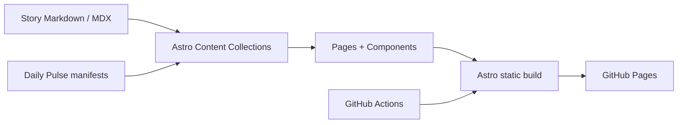

# Architecture

## Overview

The Daily AI Pulse is a static-first technical publication built with Astro. The repository separates editorial content from presentation so stories can be authored as Markdown/MDX, validated through Astro content collections, and rendered into static pages for GitHub Pages.



There is no application server in the production path. The deployed artifact is static HTML, CSS, assets, and any deliberately added client-side JavaScript.

## Repository boundaries

```text
src/
├── components/          Reusable presentation and interaction components
├── content/
│   ├── stories/         Canonical standalone articles
│   └── pulse/           Daily edition manifests that reference stories
├── layouts/             Shared document/page shells
├── pages/               File-based routes and category/archive pages
├── styles/              Global styles and design tokens
└── content.config.ts    Content schemas and validation

public/
└── images/              Publication and story imagery copied as static assets

docs/                    Product, editorial, design, architecture, and publishing docs
.github/workflows/        CI/CD and GitHub Pages deployment
```

## Content model

### Stories

A story is the canonical unit of editorial content. Story frontmatter is validated by `src/content.config.ts` and includes:

- title and description;
- publication date;
- category and tags;
- story format (`pulse`, `briefing`, `deep-dive`);
- difficulty and signal level;
- evidence level;
- companies, sources, and optional editorial image metadata.

This metadata supports category views, article pages, related-story logic, evidence labelling, feeds, and future search/filtering.

### Daily editions

A daily Pulse file is a curated manifest rather than a second copy of article text. It contains a date, title, summary, featured story ID, and ordered sections containing story IDs.

That separation prevents duplicated editorial content and allows one article to appear in daily, category, archive, and related-content surfaces.

## Routing and rendering

Astro's file-based pages build the publication into static routes. Dynamic-looking routes such as individual story pages are generated at build time from the content collection.

All internal asset and navigation paths must respect the configured GitHub Pages base path (`/daily-ai-pulse/`). Prefer `import.meta.env.BASE_URL` and `Astro.site` over hard-coded root-relative assumptions.

## Design architecture

The project intentionally uses a small component system rather than a general-purpose application framework. Components such as story cards, the big-story treatment, navigation, article table of contents, and daily-issue rows consume validated content data and focus on presentation.

The design system and page composition documents under `docs/` are the visual source of truth.

## Build and deployment

The production path is:

```text
push to main
    ↓
GitHub Actions
    ↓
npm ci
    ↓
npm run build
    ↓
astro check + astro build
    ↓
upload static dist artifact
    ↓
GitHub Pages deployment
```

The workflow uses Node.js 22 and GitHub's Pages deployment actions. The build should remain reproducible from `package-lock.json`.

## Architectural principles

### Static by default

Prefer build-time rendering and plain HTML/CSS. Add browser JavaScript only when a feature requires interaction.

### Content is data

Editorial structure belongs in typed frontmatter and Markdown, not hard-coded page markup.

### One canonical story

Daily editions and category surfaces should reference a story rather than duplicate its body.

### Evidence is part of the schema

Evidence quality, sources, and editorial metadata are product features, not informal conventions.

### Deployment paths are environment-aware

The project is hosted below a GitHub Pages base path, so links and assets must be generated with the configured base/site values.

### Small, reviewable changes

Content editions, platform features, and design changes should generally be independent pull requests so failures and regressions are easier to isolate.

## Current validation and limits

PR CI runs `npm run verify` (lint, formatting, content integrity, editorial and
illustration checks when a ledger exists, Astro checks, build, and Pagefind)
plus a Playwright browser smoke/accessibility job. Dependencies are pinned in
`package.json` and locked by `package-lock.json`.

The browser link check covers homepage internal links, not every route or
external source. Editorial source claims and external URLs still require human
verification. The editorial and illustration validators skip when no dated
ledger has been committed; a publishing batch must pass them with its explicit
ledger path before opening a draft PR. The reference layouts under `docs/`
remain design proposals until implemented in the Astro pages.
