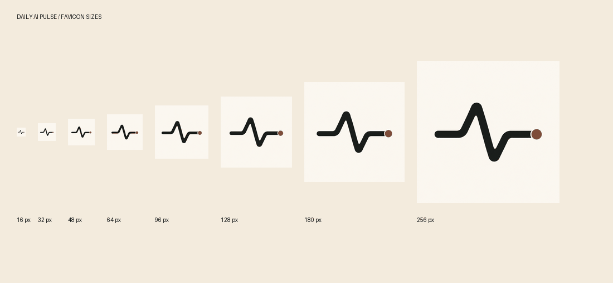

# Favicon assets

The publication uses a bold ink pulse with a terracotta signal dot on warm paper.
The palette follows the publication's visual identity. This is a brand icon;
the editorial illustration constitution governs story artwork, not favicon geometry.

## Files

- `public/favicon.ico`: embedded 16, 24, 32, 48, and 64 pixel frames.
- `public/icons/favicon-{size}x{size}.png`: 16, 24, 32, 48, 64, 96, 128, 144, 152, 180, 192, 256, 384, 512, and 1024 pixels.
- `public/apple-touch-icon.png`: 180 pixels.
- `public/icons/maskable-{size}x{size}.png`: 192 and 512 pixels with extra safe padding.
- `public/site.webmanifest`: relative icon paths, scope, identity, and start URL.
- `docs/assets/favicon-master.png`: original generated master.

The shared Astro layout resolves icon and manifest URLs using `BASE_URL`.
Manifest URLs are relative to the manifest, so they work under the
`/daily-ai-pulse/` deployment prefix and on root-hosted deployments.
The manifest provides app icon metadata; offline caching is not implemented.

## Artwork and export

The master was generated using the built-in image-generation tool. All raster
sizes use Pillow Lanczos downsampling from that master. Maskable variants scale
the master to 80% within a paper-colored square. Keep this committed master as
the source for future size exports.

Generation prompt:

> Use case: logo-brand. Asset type: production favicon master for The Daily AI Pulse, an AI news publication with the motto Signal over noise. Create one crisp square icon, full bleed warm paper background #FAF6EE, featuring ONE bold near-black #171B1A horizontal pulse waveform centered, with one pronounced upward peak and one downward trough, and one small restrained terracotta #8A4B35 circular signal dot at the right endpoint. Graphic occupies about 70 percent width and 48 percent height. Heavy uniform stroke, simple clean geometric silhouette, flat solid fills, precise sharp edges, generous whitespace. Must be instantly recognizable at 16x16 pixels. Quiet confident scientific editorial identity. No letters, words, numbers, robot, brain, chip, thin detail, texture, gradients, shadows, border, frame, mockup, grid, or multiple variants. Exactly one icon filling one square canvas.

## Verification

PNG dimensions, manifest asset references, and all five embedded ICO dimensions
were checked during export. The preview was inspected at actual small sizes.
Full lint, formatting, Astro checks, build, and browser checks run in PR CI.
