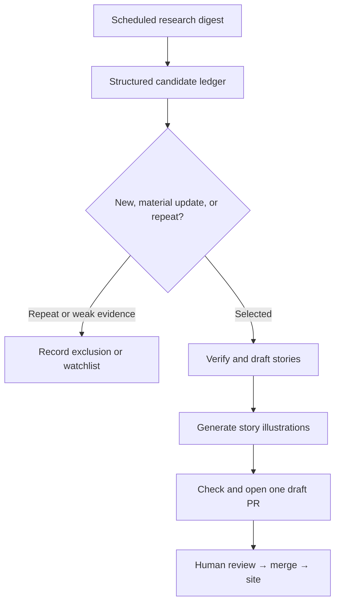

# Daily AI Pulse — Decision Engine v1

**Version:** 1.0  
**Status:** Canonical editorial workflow  
**Depends on:** `EDITORIAL_SCHEMA_V1.md`, `TOPICS_V1.yml`

This document defines how a discovered AI development becomes a selected story, a watch item, an exclusion, or a downstream editorial opportunity.

The decision engine is designed for both humans and automated research agents. It should produce the same decision structure regardless of who performs the research.

## 1. Canonical pipeline



The **candidate ledger is the authoritative handoff** between research and all downstream skills.

Downstream drafting, illustration, and PR-preparation steps must not silently reclassify desk, evidence, signal, depth, novelty, or deduplication status.

If a downstream step discovers conflicting evidence, it must report the conflict and return the candidate for editorial review.

## 2. Responsibilities by stage

### Stage A — Scheduled research digest

Purpose: discover potentially important developments.

Responsibilities:

- search broadly enough to avoid vendor-only coverage;
- prefer primary technical sources;
- identify actual event date separately from article publication date;
- collect canonical URLs;
- detect candidate developments, not just headlines;
- avoid drafting polished stories at this stage.

Output: raw candidate set.

### Stage B — Structured candidate ledger

Purpose: normalize candidates into the canonical schema.

For every candidate:

1. identify the underlying event/change;
2. normalize source URLs;
3. assign one primary desk;
4. assign topics from `TOPICS_V1.yml`;
5. evaluate novelty and previous coverage;
6. assess evidence;
7. assess signal;
8. score the candidate;
9. recommend a format and depth;
10. identify learning gaps and follow-up opportunities;
11. assign one decision: `selected`, `watch`, or `rejected`.

The ledger must preserve exclusions. Rejected repeats should not disappear silently.

### Stage C — Novelty and material-change gate

Core question:

> Is this a genuinely new development, a material update to prior coverage, or merely another retelling of the same event?

Compare:

- canonical source URL after tracking parameters are removed;
- product, paper, project, model, company, or system involved;
- actual technical change;
- event date;
- previously published Pulse stories;
- previous candidates in the ledger.

#### New

A previously uncovered development with a distinct technical or operational change.

Default: continue evaluation.

#### Material update

A previously covered subject with a meaningful new delta such as:

- new release;
- new benchmark;
- independent reproduction;
- correction;
- security disclosure;
- pricing change;
- availability change;
- architectural change;
- production adoption result;
- new technical documentation;
- new research evidence.

Default: continue evaluation and link previous coverage.

#### Repeat

Examples:

- a second article describing the same release;
- social reaction to an already covered announcement;
- marketing summary with no new technical information;
- rewritten headline;
- duplicate syndication;
- retrospective commentary with no material delta.

Default: reject as duplicate and record the reason.

## 3. Verification gate

A candidate cannot be selected until the central factual claim is traceable to evidence.

Verify:

- the event/release actually occurred;
- the date is credible;
- quoted metrics exist in the source;
- product capabilities are not inferred from marketing language;
- paper status is correctly described;
- vendor claims are clearly labelled as vendor claims;
- independent validation is distinguished from first-party reporting.

If archive access, primary-source access, or deduplication cannot be verified, say so explicitly.

Never infer missing metrics, settings, architecture details, dates, or benchmark results.

## 4. Evidence gate

Use the evidence levels from `EDITORIAL_SCHEMA_V1.md`.

Default handling:

| Evidence | Default handling |
| --- | --- |
| `strong` | eligible for selection |
| `primary` | eligible for selection with claim scope made explicit |
| `preliminary` | eligible if significance and relevance justify it |
| `anecdotal` | eligible mainly for Workflows, AI in Practice, or clearly framed practitioner evidence |
| `unverified` | watch or reject; do not normally publish |

Weak evidence does not automatically mean reject. It may mean `watch` when the development could become important after validation.

## 5. Editorial scoring

Score each candidate 1–5 for:

- significance — 30%
- evidence — 25%
- novelty — 20%
- relevance — 15%
- durability — 10%

Use the weighted formula defined in `EDITORIAL_SCHEMA_V1.md`.

Default thresholds:

| Score | Default decision |
| ---: | --- |
| 80–100 | strong candidate for `selected` |
| 65–79 | editorial judgment required |
| 50–64 | usually `watch` |
| <50 | usually `rejected` |

Scores never override hard gates.

## 6. Hard selection gates

A candidate must not be selected when any of the following applies:

- no material change exists;
- primary facts cannot be verified;
- the item is a duplicate without a material delta;
- the headline requires exaggeration to appear important;
- technical relevance is artificial;
- the source contains only generic marketing language;
- the only change is cosmetic UI or a trivial version bump;
- important metrics cannot be traced;
- the story depends primarily on rumor or unattributed claims.

## 7. Select / Watch / Reject

### Selected

Use when:

- novelty or material delta is established;
- central claims are verified to the appropriate evidence level;
- engineering relevance is clear;
- signal is sufficient;
- the candidate can be explained without overstating evidence.

Selected candidates proceed to drafting.

### Watch

Use when the development could matter but publication would currently be premature.

Typical reasons:

- pre-announcement without release;
- important benchmark lacks sufficient detail;
- independent verification is likely soon;
- adoption or durability remains unclear;
- technical documentation is missing;
- evidence is too weak for current claims.

Every watch item should state a promotion condition.

Example:

```yaml
decision: watch
watch_until:
  - independent benchmark is published
  - technical report becomes available
```

### Rejected

Use when:

- duplicate;
- no material delta;
- pure marketing;
- rumor;
- generic funding story;
- superficial UI update;
- irrelevant to engineers;
- weak source with no durable value;
- engagement bait;
- result cannot be meaningfully interpreted.

Every rejection must record a concise reason.

## 8. Desk assignment

Assign exactly one desk according to the **main new contribution**.

Do not duplicate one development across desks to improve coverage balance.

When uncertain, ask:

> If the reader remembers only one thing about this development, what changed?

Examples:

- new model capability → `models`
- paper about the mechanism behind that capability → `research`
- tool engineers can install → `tools`
- runtime/security architecture → `engineering`
- repeatable configuration or team practice → `workflows`
- measured deployment result → `practice`
- market/platform economics → `business`
- surprising behavior whose main value is the observation → `curious`

## 9. Format recommendation

The ledger recommends one primary editorial format.

### Briefing

Choose when the core value is understanding the current delta.

### Explainer

Choose when the main value is understanding a reusable concept and the current event is the editorial trigger.

### Deep Dive

Choose when understanding mechanism, architecture, trade-offs, or multiple sources materially changes the conclusion.

### Playbook

Choose when the reader can apply a repeatable engineering approach.

### Case Study

Choose when the evidence and lessons come from a concrete real-world deployment.

Decision order:

```text
Is the value mainly “what changed?”
  → Briefing

Is a reusable concept the real learning opportunity?
  → Explainer

Does mechanism/architecture materially matter?
  → Deep Dive

Is there a repeatable action/configuration?
  → Playbook

Is the core contribution a real deployment and its outcomes?
  → Case Study
```

The recommendation is not a quota. Some selected candidates should remain a Briefing only.

## 10. Depth recommendation

Depth describes prerequisites.

### Foundation

Use when a competent software engineer can understand the story without existing AI specialization because the article defines the necessary concepts.

### Practitioner

Use when normal modern AI-engineering concepts can be assumed: LLM APIs, prompts/context, tool calling, agents, APIs, and basic architecture.

### Advanced

Use when meaningful comprehension requires specialist ML, distributed inference, security internals, research methodology, optimization, or comparable depth.

If unsure between two levels, list prerequisites and choose the lower level only if the article will actually explain the missing concepts.

## 11. Learning-gap detection

For every selected candidate ask:

> What reusable concept might prevent a competent software engineer from understanding why this matters?

Set `learning_gap.exists: true` only when:

- the story is important enough to justify learning investment;
- the concept will recur beyond this one story;
- many software engineers may reasonably lack it;
- no adequate Pulse explainer already exists.

Learning gaps create **editorial opportunities**, not automatic articles.

Example:

```yaml
learning_gap:
  exists: true
  concepts:
    - sandboxing
  suggested_explainer: "What Is an AI Agent Sandbox?"
```

## 12. Multi-format expansion

One development may support several pieces:

```text
Development
 ├── Briefing  → what shipped?
 ├── Explainer → what concept do I need?
 ├── Deep Dive → how does the mechanism work?
 └── Playbook  → what should I do?
```

Do not automatically generate all of them.

Expansion requires independent editorial justification:

| Situation | Possible expansion |
| --- | --- |
| important unfamiliar concept | Explainer |
| mechanism is technically consequential | Deep Dive |
| repeatable practice exists | Playbook |
| deployment contains meaningful evidence | Case Study |
| none of the above | Briefing only |

## 13. Candidate ledger contract

The scheduled research task should ultimately emit a machine-readable ledger containing selected, watch, and rejected candidates.

Example:

```yaml
editorial_date: 2026-09-29
schema_version: "1.0"
decision_engine_version: "1.0"

candidates:
  - id: 2026-09-29-example
    title: "Example development"
    decision: selected
    desk: engineering
    format: briefing
    depth: practitioner
    topics:
      - agents
      - agent-security
    evidence:
      level: primary
      rationale: "Official technical disclosure."
    signal:
      level: high
      rationale: "Changes assumptions about agent isolation."
    editorial_score:
      significance: 5
      evidence: 4
      novelty: 5
      relevance: 5
      durability: 4
      weighted_total: 93
    deduplication:
      candidate_key: "..."
      canonical_event: "..."
      previous_coverage: null
      material_delta: "new disclosure"
    learning_gap:
      exists: true
      concepts:
        - sandboxing
      suggested_explainer: "What Is an AI Agent Sandbox?"

exclusions:
  - id: 2026-09-29-repeat-example
    decision: rejected
    reason: duplicate-no-material-delta
    previous_story_id: 2026-09-28-example

watchlist:
  - id: 2026-09-29-watch-example
    decision: watch
    reason: benchmark-not-independently-verified
    promote_when:
      - independent results become available
```

## 14. Downstream handoff rules

### Drafting skill

May:

- deepen source verification;
- improve wording;
- add context;
- report classification conflicts.

Must preserve by default:

- candidate identity;
- desk;
- selected/watch/rejected status;
- evidence level;
- signal level;
- depth;
- deduplication result;
- schema version.

### Illustration skill

Consumes selected drafted stories only.

It must not alter editorial metadata.

### PR preparation skill

Consumes:

- candidate ledger;
- selected story drafts;
- generated illustrations;
- exclusion/watchlist evidence.

It should verify:

- no duplicate story files;
- every selected story maps back to a ledger candidate;
- excluded candidates were not accidentally drafted;
- images exist and are referenced correctly;
- content schema validates;
- links and sources resolve where possible;
- the draft PR visibly reports exclusions/watchlist items relevant to reviewer confidence.

It opens **one draft PR** for the editorial batch.

### Human review

Human review is the final authority before merge.

Editors may override classifications, but the PR should state the reason when an override changes a substantive ledger decision.

## 15. Daily output philosophy

Do not aim for one story per desk.

A valid day may contain:

```text
3 selected
4 watch
12 rejected/repeat
```

That is better than publishing eight mediocre stories to make the page appear full.

The research system is successful when it confidently rejects noise.

## 16. Must Know

The daily issue may designate one selected candidate as `Must Know` when it combines:

- high significance;
- strong novelty;
- clear engineering relevance;
- credible evidence.

No `Must Know` is required.

## 17. Failure behavior

If any canonical editorial dependency is unavailable:

- do not silently recreate it from memory;
- state which dependency could not be read;
- preserve raw candidates and sources;
- avoid claiming that classification or deduplication was verified.

Examples:

```text
Editorial schema unavailable — classification not verified.
Archive unavailable — deduplication not verified.
Topic vocabulary unavailable — topics not validated.
```

## 18. Five non-negotiable invariants

These rules should remain embedded in the scheduled-task prompt even when all other policy lives in repository contracts:

1. Never invent sources, metrics, settings, dates, or implementation details.
2. Prefer primary evidence and label claim scope.
3. Never republish a duplicate without a material delta.
4. Fewer strong stories are preferable to filler.
5. If an editorial contract cannot be read, say so instead of inventing replacement rules.

## 19. Definition of a successful run

A successful Daily AI Pulse research run produces a ledger where a reviewer can answer:

- What did we find?
- What did we reject and why?
- What are we watching?
- What is genuinely new?
- How strong is the evidence?
- Which stories should be drafted?
- Which concepts deserve future explainers?
- Can every selected item be traced back to verified evidence?

The output is not “today's AI news.”

It is a reproducible editorial decision record.
