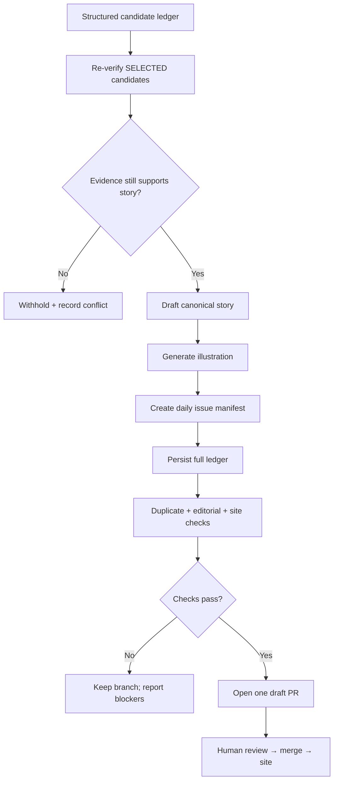

# Daily AI Pulse — PR Preparation v1

**Version:** 1.0  
**Status:** Canonical publication handoff  
**Agent skill:** `.agents/skills/daily-ai-pulse-pr-preparation/SKILL.md`

This document defines the contract between the structured candidate ledger and the human-reviewable publication pull request.

## Purpose

The PR preparation stage converts editorial decisions into a reviewable website batch without silently changing those decisions.



## Inputs

Required:

- structured candidate ledger from the ChatGPT scheduled Daily AI Pulse research task
- `EDITORIAL_SCHEMA_V1.md`
- `DECISION_ENGINE_V1.md`
- `TOPICS_V1.yml`
- current site content schema and publishing contract

The ChatGPT scheduler starts the task at its configured cadence; the task
discovers news, reads the repository's editorial contracts, and produces the
selected/watch/rejected ledger. It does not itself publish the site. An editor
starts PR preparation by handing the ledger to the PR preparation skill; the repository's GitHub Actions
run checks on the PR and deploy only after merge to `main`.

Illustration dependency:

- `$daily-ai-pulse-illustration`

## Outputs

A successful editorial batch normally creates:

```text
src/content/stories/<story-id>.md
public/images/stories/<story-id>.webp
src/content/pulse/YYYY-MM-DD.md
docs/editorial/ledgers/YYYY-MM-DD.json
```

and opens exactly one draft pull request.

## Authority boundary

The candidate ledger owns:

- candidate identity
- select/watch/reject decision
- desk
- format recommendation
- depth
- evidence level
- signal level
- deduplication result
- editorial versions

PR preparation owns:

- publication-time source verification
- story wording and structure
- current-site compatibility mapping
- illustration generation
- daily issue manifest
- deterministic validation
- publication audit trail
- draft PR creation

A downstream conflict does not silently rewrite the ledger. The selected candidate is withheld and the conflict is shown to the reviewer.

## Durable editorial memory

Every editorial PR persists its normalized candidate ledger at:

```text
docs/editorial/ledgers/YYYY-MM-DD.json
```

Merged ledgers are part of future deduplication. They record not only what was published, but also what was watched, rejected, or judged to be a repeat.

This prevents the research system from repeatedly rediscovering the same weak or already-covered candidates.

## Publication states

The original research decision is immutable inside the batch.

Publication adds a separate outcome:

- `published`
- `withheld-verification-conflict`
- `withheld-duplicate-conflict`
- `withheld-source-unavailable`
- `withheld-validation-failure`

A candidate can therefore remain `decision: selected` while not appearing in the final story set.
Record the publication duplicate recheck in
`deduplication.publication_status` without changing the research
`deduplication.status`.

## Drafting gate

Only candidates with:

```text
decision = selected
AND publication verification = verified | verified-with-claim-scope
AND dedup publication check = new-confirmed | material-update-confirmed
```

may proceed automatically to drafting.

`watch` and `rejected` candidates must never be drafted by this stage unless a human explicitly records an editorial override.

## Illustration gate

A drafted story is not publication-ready until:

- the primary illustration exists
- frontmatter references the exact asset path
- alt text is meaningful
- article and thumbnail crops have been checked
- the image does not introduce unsupported facts or product UI

## Validation gate

Before opening a PR, run:

```bash
npm run editorial:check -- docs/editorial/ledgers/YYYY-MM-DD.json
npm run verify
```

Blocking failures stop PR creation.

The editorial validator covers ledger-to-story integrity and duplicate safety. The existing site verification covers formatting, content integrity, Astro/TypeScript, image references, and production build health.

## PR contract

One day/batch produces one draft PR.

Required reviewer visibility:

- selected stories
- desk / format / depth
- evidence / signal / score
- publication verification status
- primary and independent evidence notes
- deduplication result
- material delta when relevant
- withheld selected candidates
- watchlist
- rejected/already-covered candidates
- editorial opportunities
- illustration paths
- validation status
- any human override

The PR body is an editorial audit surface, not only a code-change summary.

## Failure behavior

Do not open a publication-ready PR when:

- no valid ledger exists
- canonical contracts cannot be read
- selected claims cannot be verified
- duplicate conflicts remain
- no selected candidate survives verification
- illustrations are missing
- content/site checks fail

Keep the work on the branch and report the exact blockers.

## Success condition

A reviewer should be able to decide whether to merge the daily issue without reconstructing the research process from chat history or hidden agent state.
