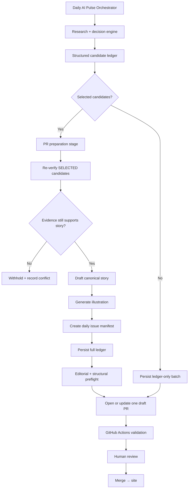

# Daily AI Pulse — PR Preparation v1

**Version:** 1.1  
**Status:** Canonical automated publication handoff  
**Agent skill:** `.agents/skills/daily-ai-pulse-pr-preparation/SKILL.md`

This document defines the contract between the structured candidate ledger,
automated publication preparation, the draft pull request, repository
validation, and final human editorial review.

## Purpose

PR preparation is an automated stage of the Daily AI Pulse orchestrator.

It converts editorial decisions into a reproducible, human-reviewable website
batch without silently changing those decisions and without crossing the human
publication boundary.



## Inputs

Required:

- structured candidate ledger produced by the research-and-decision phase of
  the Daily AI Pulse orchestrator
- `EDITORIAL_SCHEMA_V1.md`
- `DECISION_ENGINE_V1.md`
- `TOPICS_V1.yml`
- current site content schema and publishing contract

The ChatGPT Daily AI Pulse orchestrator starts at its configured cadence. It
discovers news, reads the repository's editorial contracts, applies the
decision engine, performs research deduplication, and produces the
selected/watch/rejected candidate ledger.

When one or more candidates are selected, the same orchestrated run continues
into PR preparation automatically. No separate editor invocation is required.

When no candidate is selected, the orchestrator still persists the daily
ledger and prepares the canonical ledger-only batch.

PR preparation stops at a draft pull request. GitHub Actions validates that
pull request, and publication occurs only after human editorial review and a
human-approved merge to `main`.

Illustration dependency:

- `$daily-ai-pulse-illustration`

## Orchestration boundary

The orchestrator owns:

- triggering the daily run
- research
- applying the decision engine
- research-time deduplication
- creation of the candidate ledger
- creation or reuse of the canonical daily branch
- passing the ledger into PR preparation
- opening or updating the day's draft PR
- reporting the final operational state

PR preparation owns:

- publication-time source verification
- publication-time deduplication
- story wording and structure
- current-site compatibility mapping
- illustration generation
- daily issue manifest
- ledger publication state
- editorial and structural preflight validation
- publication audit trail
- draft PR contents

GitHub Actions owns:

- executable repository validation triggered by the pull request

A human editor owns:

- substantive editorial overrides
- final editorial review
- the decision that the batch is acceptable
- merge approval

Automation must never merge, auto-merge, or bypass the human review boundary.

## Outputs

A publication batch normally creates:

```text
src/content/stories/<story-id>.md
public/images/stories/<story-id>.webp
src/content/pulse/YYYY-MM-DD.md
docs/editorial/ledgers/YYYY-MM-DD.json
```

A zero-story day normally creates:

```text
docs/editorial/ledgers/YYYY-MM-DD.json
```

Both modes use the same canonical daily branch and at most one draft pull
request.

## Daily batch identity

Each editorial date has one canonical publication branch:

```text
content/daily-ai-pulse-YYYY-MM-DD
```

and at most one publication pull request:

```text
content: prepare Daily AI Pulse for YYYY-MM-DD
```

Before creating a branch or pull request, the orchestrator must check whether
the canonical branch or PR already exists.

A retry or repeated scheduled run for the same editorial date MUST update or
continue the existing batch. It MUST NOT create a second publication branch or
duplicate PR.

The daily batch must never write editorial changes directly to `main`.

## Authority boundary

The candidate ledger owns:

- candidate identity
- select/watch/reject decision
- desk
- format recommendation
- depth
- evidence level
- signal level
- research-time deduplication result
- editorial versions

PR preparation owns:

- publication-time source verification
- publication-time deduplication result
- story wording and structure
- current-site compatibility mapping
- illustration generation
- daily issue manifest
- publication-state fields
- publication audit trail
- draft PR preparation

A downstream conflict does not silently rewrite the ledger's research
decision.

A candidate may remain:

```text
decision: selected
```

while being withheld from publication because later verification failed.

## Durable editorial memory

Every daily run MUST persist its normalized candidate ledger at:

```text
docs/editorial/ledgers/YYYY-MM-DD.json
```

The filename date MUST equal `editorial_date`.

The ledger records:

- selected candidates
- watch candidates
- rejected/already-covered candidates
- research deduplication
- publication deduplication
- publication verification
- withheld selected candidates
- story mappings
- Must Know mapping where applicable

Merged ledgers are part of future research and publication deduplication.

They record not only what was published but also what was watched, rejected, or
judged to be a repeat. This prevents the system from repeatedly rediscovering
the same weak or already-covered candidates.

Previously merged daily ledgers are immutable during ordinary runs. Corrections
require a deliberate correction PR.

## Publication states

The original research decision is immutable inside the batch.

Publication adds a separate outcome, for example:

- `published`
- `withheld-verification-conflict`
- `withheld-duplicate-conflict`
- `withheld-source-unavailable`
- `withheld-validation-failure`

A candidate can therefore remain `decision: selected` while not appearing in
the final story set.

Record the publication duplicate recheck in:

```text
deduplication.publication_status
```

without changing the research:

```text
deduplication.status
```

## Drafting gate

Only candidates with:

```text
decision = selected
AND publication verification = verified | verified-with-claim-scope
AND dedup publication check = new-confirmed | material-update-confirmed
```

may proceed automatically to drafting.

`watch` and `rejected` candidates must never be drafted unless a human
explicitly records an editorial override.

## Ledger-only batches

A valid daily run may produce zero publishable stories.

A zero-story day is an editorial outcome, not a pipeline failure.

When no candidate is selected:

- do not manufacture content
- persist the complete candidate ledger
- do not create story files
- do not generate illustrations
- do not create a daily issue unless the current site contract explicitly
  requires one
- open or update the canonical draft PR as a `ledger-only` batch
- expose selected/watch/rejected counts in the PR
- explain why no story was published

When candidates were initially selected but none survive publication-time
verification, preserve the original research decisions and record the
candidates under `publication.withheld_selected`.

That batch may also become ledger-only.

## Illustration gate

Every drafted story requires one approved primary illustration unless the
repository contract explicitly records an approved reusable asset.

Before the story can be considered publication-ready:

- the primary illustration exists
- frontmatter references the exact asset path
- alt text is meaningful
- article and thumbnail crops have been checked
- the image does not introduce unsupported facts
- the image does not invent product UI or technical evidence

## Validation model

Validation has two layers.

### 1. Editorial and structural preflight

Before opening or updating the draft PR, validate everything possible without
executing the full repository:

- ledger structure
- candidate ID uniqueness
- selected story ↔ ledger mapping
- controlled topics
- source presence
- canonical-source deduplication
- publication verification states
- no watch/rejected candidate was drafted
- illustration references
- daily issue references
- duplicate story references
- canonical daily branch and PR identity

Blocking editorial, source, deduplication, or structural failures prevent the
batch from being presented as valid publication work.

### 2. Executable repository validation

When a repository execution environment is available, run:

```bash
npm run editorial:check -- docs/editorial/ledgers/YYYY-MM-DD.json
npm run illustration:check -- docs/editorial/ledgers/YYYY-MM-DD.json
npm run verify
```

The editorial validator covers ledger-to-story integrity and duplicate safety.

Illustration validation covers required artwork and review records.

`npm run verify` covers formatting, content integrity, Astro/TypeScript checks,
editorial validation, image references, and production build health according
to the current repository configuration.

When the orchestration environment cannot execute repository commands, it MUST
NOT claim that executable validation passed.

The orchestrator may still open the batch as a **draft PR** after all editorial
and structural preflight gates pass.

The PR body must record:

```text
Local executable validation: not run in scheduler environment
```

Pull-request GitHub Actions then becomes the executable validation gate.

A draft PR with pending or failed CI is never publication-ready.

## PR contract

One editorial date produces at most one canonical draft PR.

Required reviewer visibility:

- editorial date
- batch mode: `publication` or `ledger-only`
- selected stories
- desk / format / depth
- evidence / signal / score
- publication verification status
- primary and independent evidence notes
- research and publication deduplication result
- material delta when relevant
- withheld selected candidates
- watchlist
- rejected/already-covered candidates
- editorial opportunities
- illustration paths
- editorial preflight status
- executable validation status
- GitHub Actions status when available
- any human override

The PR body is an editorial audit surface, not only a code-change summary.

### Title

```text
content: prepare Daily AI Pulse for YYYY-MM-DD
```

### Branch

```text
content/daily-ai-pulse-YYYY-MM-DD
```

The pull request MUST remain draft throughout automated execution.

Automation must not:

- mark the PR ready for review
- enable auto-merge
- merge the PR
- bypass failing checks
- create a replacement PR because CI failed

## CI handoff

After the draft PR exists, inspect its pull-request-triggered GitHub Actions run
when possible.

Possible automation outcomes:

### CI green

Report:

```text
Draft PR ready for human review
```

The PR remains draft.

### CI failing

Keep the PR draft.

Report:

- failing workflow
- failing job or check
- actionable failure where available

Do not create another PR.

### CI pending

Report:

```text
Draft PR opened; CI pending
```

Do not claim validation passed.

## Failure behavior

Block PR creation when:

- no valid ledger can be produced
- canonical editorial contracts cannot be read
- required primary evidence is unavailable during research
- unresolved duplicate conflicts make publication identity unsafe
- the canonical daily branch cannot be safely created or reused
- branch state cannot be reconciled without risking unrelated changes

For a publication batch, selected stories must also be withheld when:

- selected claims cannot be verified
- publication duplicate checks fail
- required illustrations cannot be produced
- daily manifest construction is invalid
- structural publication relationships are inconsistent

If all selected candidates are withheld, preserve the full ledger and continue
as a ledger-only batch when doing so is safe.

Executable CI failures do not cause creation of a replacement PR. They keep the
existing PR in draft for inspection or correction.

## Human overrides

A human may override a substantive ledger decision.

When that happens, record in the PR body:

```text
Editorial override
Candidate: ...
Original decision: ...
Override: ...
Reason: ...
```

Never disguise an override as if it came from the original research ledger.

## Success condition

A successful orchestrated run ends with one durable daily branch and at most
one draft PR.

A reviewer should be able to answer:

- What did today's research find?
- Which candidates were selected?
- Which selected candidates were actually drafted?
- Which candidates were withheld and why?
- What evidence supports each story?
- What was left on watch?
- What was rejected as duplicate or insufficient?
- Is each story traceable to the ledger?
- Are illustrations present and crop-safe?
- Did editorial preflight pass?
- Did executable validation pass, fail, or remain pending?
- Did any human override occur?
- Can the batch be safely reviewed without reconstructing hidden agent state?

The output is not merely a set of Markdown files.

It is a reviewable, reproducible editorial batch with an explicit human
publication boundary.
