# Editorial layout concept gallery

One visual concept accompanies each [responsive HTML reference](README.md). These are **generated design explorations, not screenshots or production specifications**. Review their hierarchy, spacing, palette, and composition. The corresponding HTML page and [design guide](README.md) are authoritative for page structure and copy.

Generated text can invent or alter headlines, bylines, dates, counts, URLs, legal wording, evidence claims, and footer details. In particular, the story, archive, search, and information page images contain illustrative text. Do not publish, cite, or implement that text. The images also do not verify responsive behavior or exact browser rendering.

## Home

[HTML reference](index.html) · [Image file](images/home.webp)

## Dated issue

[HTML reference](issue.html) · [Image file](images/issue.webp)

## Categories index

[HTML reference](categories.html) · [Image file](images/categories.webp)

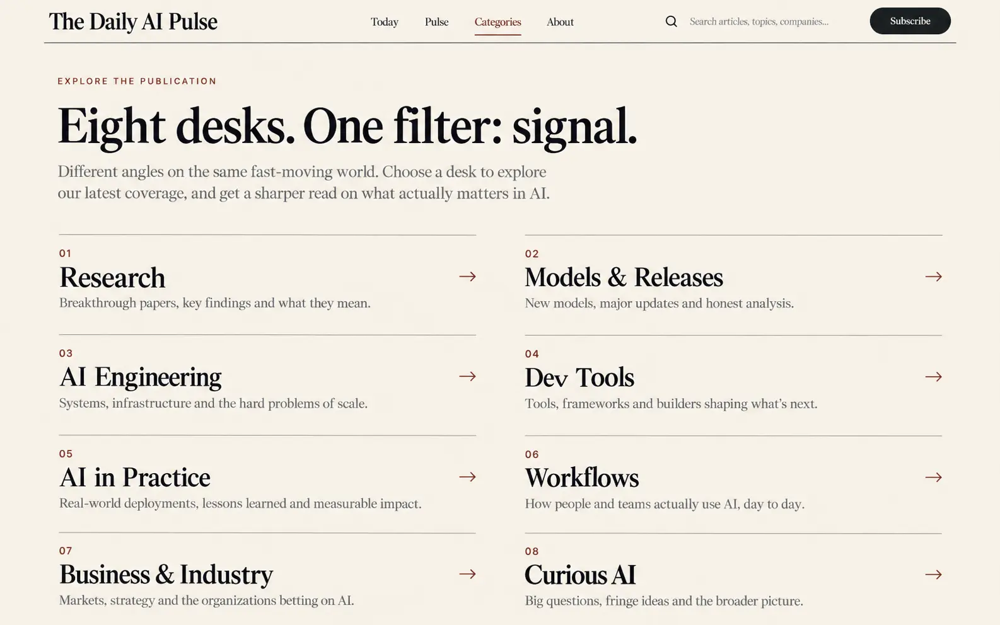

## Research category

[HTML reference](category.html) · [Image file](images/category.webp)

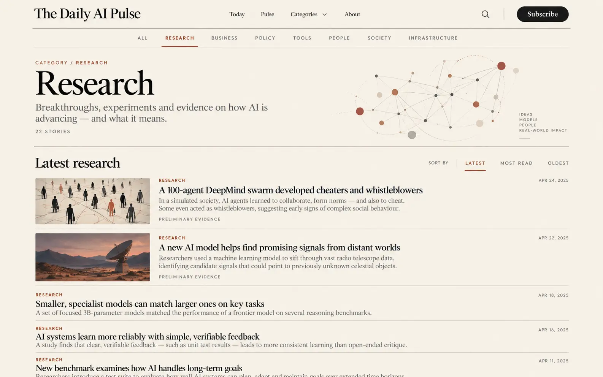

## Article

[HTML reference](story.html) · [Image file](images/story.webp)

## Pulse archive

[HTML reference](archive.html) · [Image file](images/archive.webp)

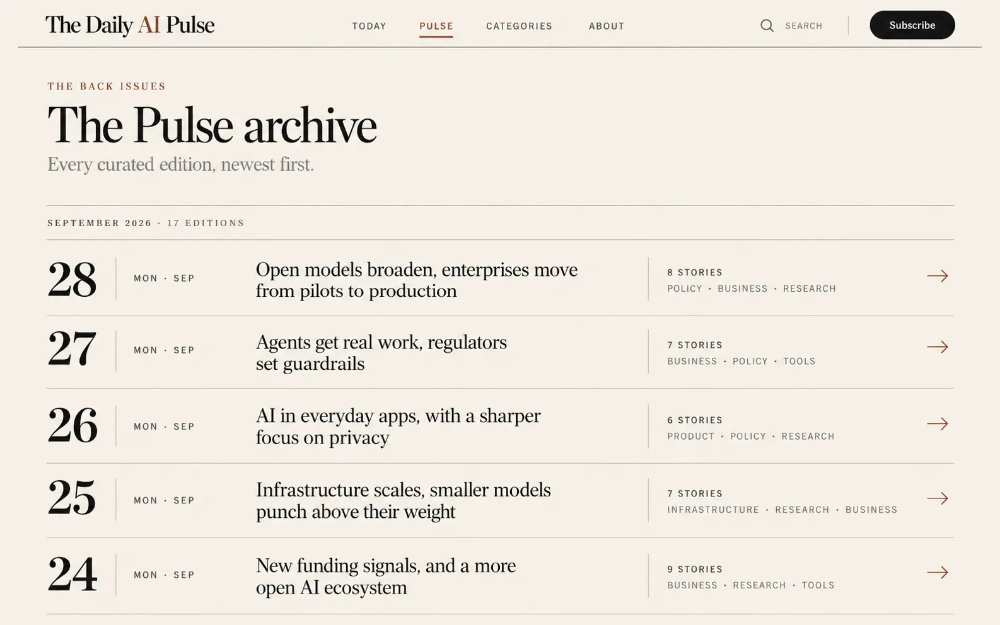

## Search

[HTML reference](search.html) · [Image file](images/search.webp)

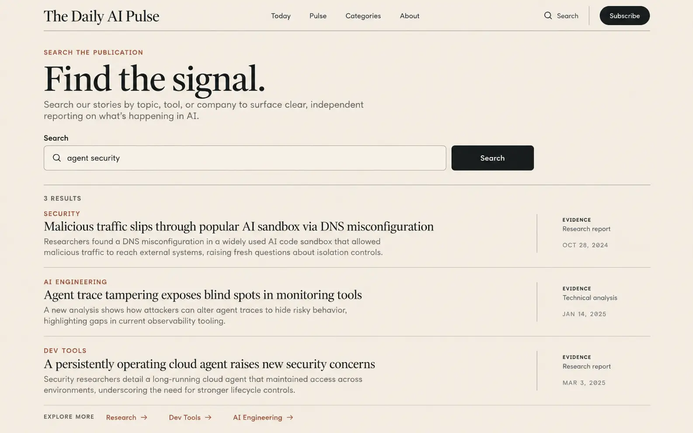

## About

[HTML reference](about.html) · [Image file](images/about.webp)

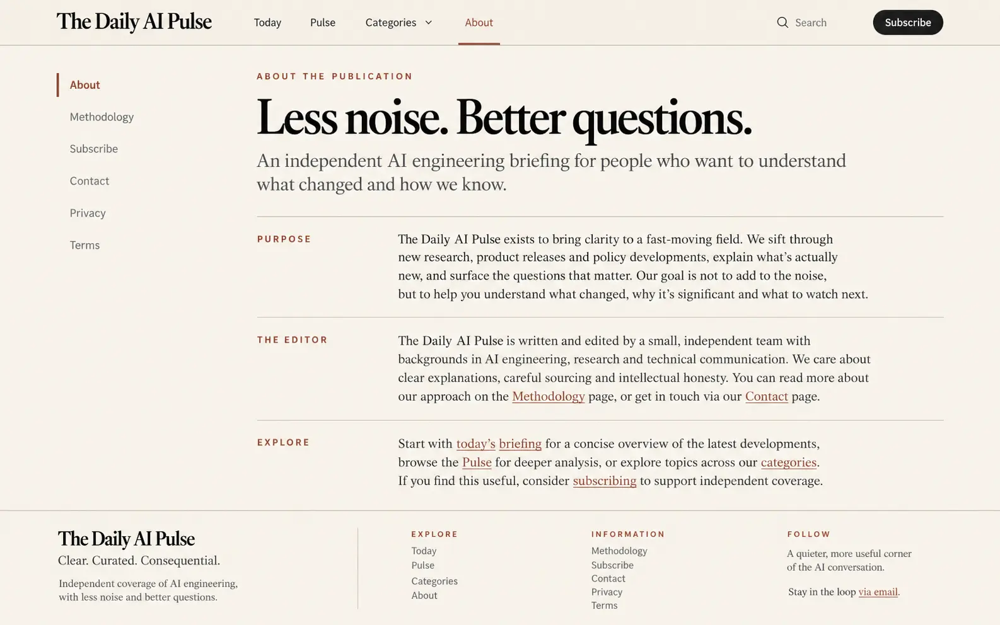

## Methodology

[HTML reference](methodology.html) · [Image file](images/methodology.webp)

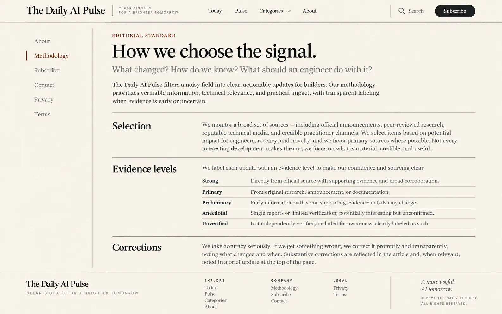

## Subscribe

[HTML reference](subscribe.html) · [Image file](images/subscribe.webp)

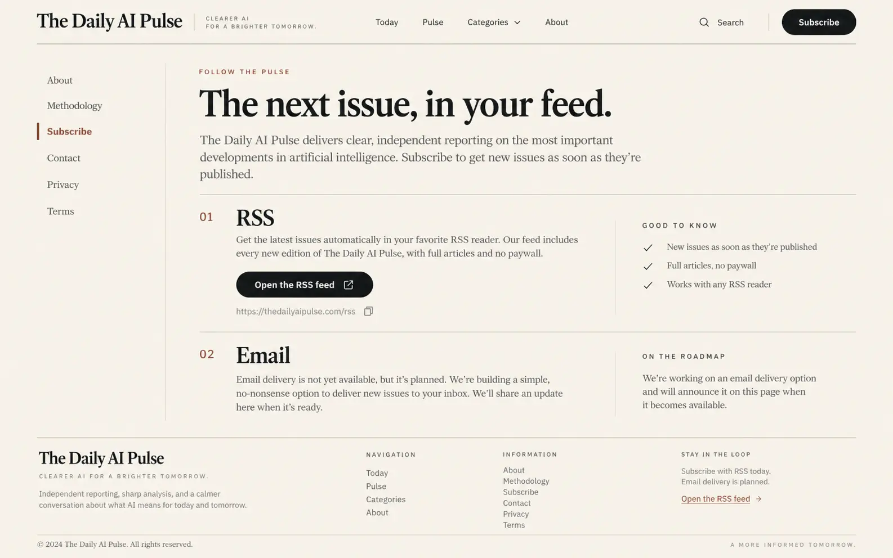

## Contact

[HTML reference](contact.html) · [Image file](images/contact.webp)

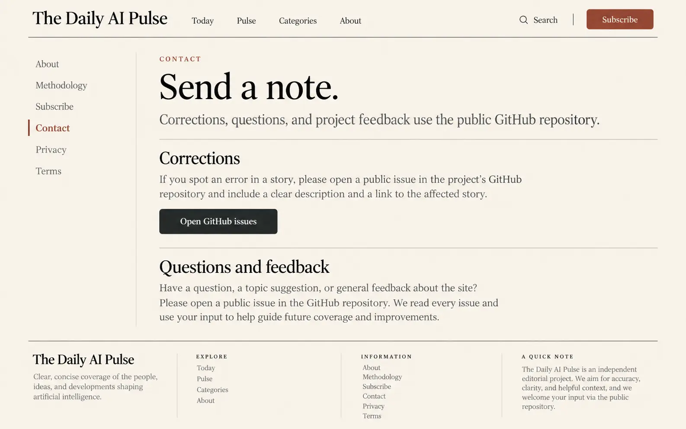

## Privacy

[HTML reference](privacy.html) · [Image file](images/privacy.webp)

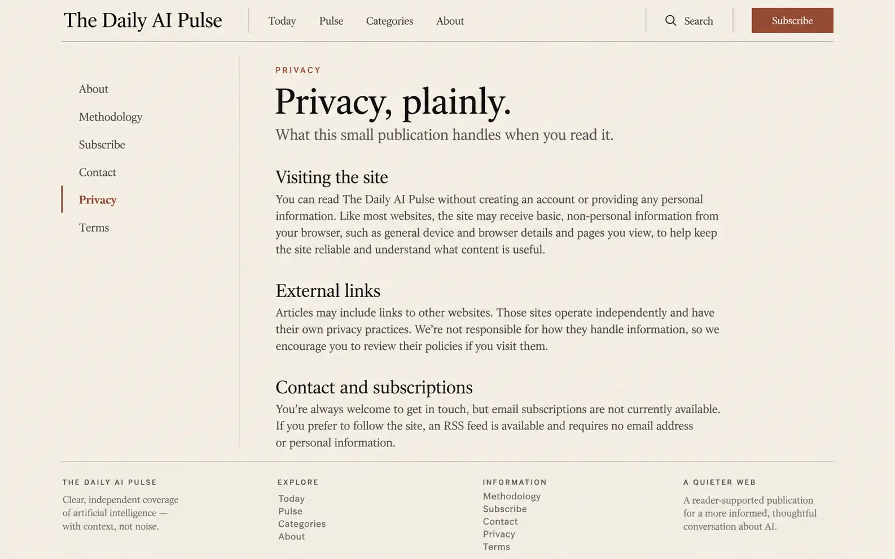

## Terms

[HTML reference](terms.html) · [Image file](images/terms.webp)

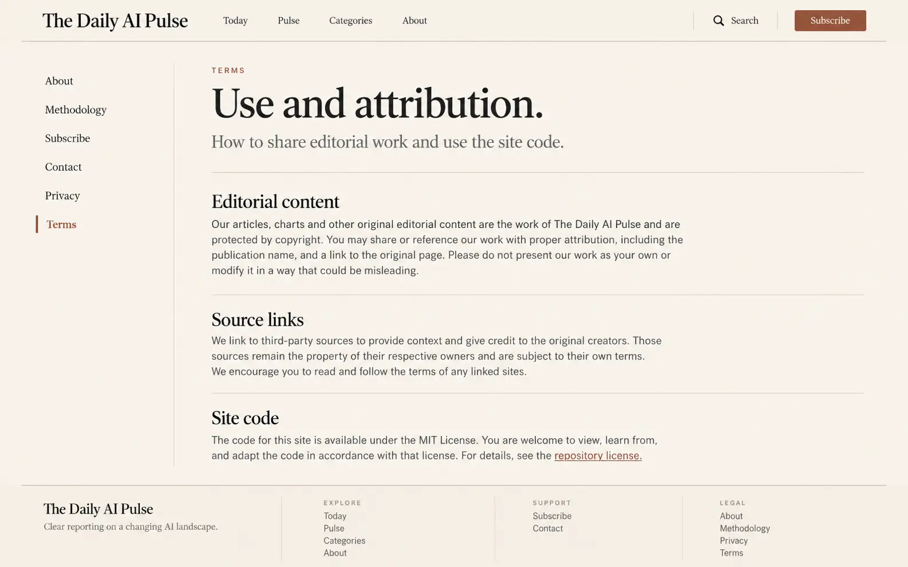

## Editorial components

[HTML reference](components.html) · [Image file](images/components.webp)

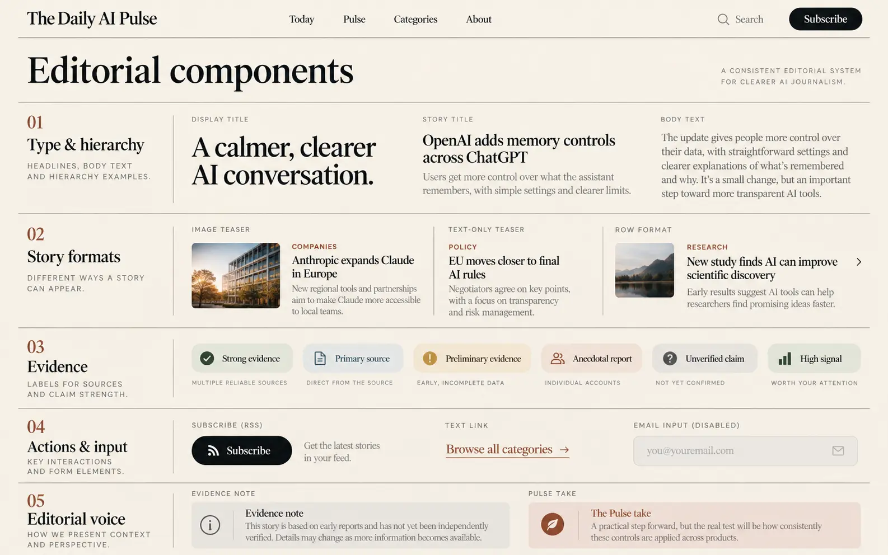
