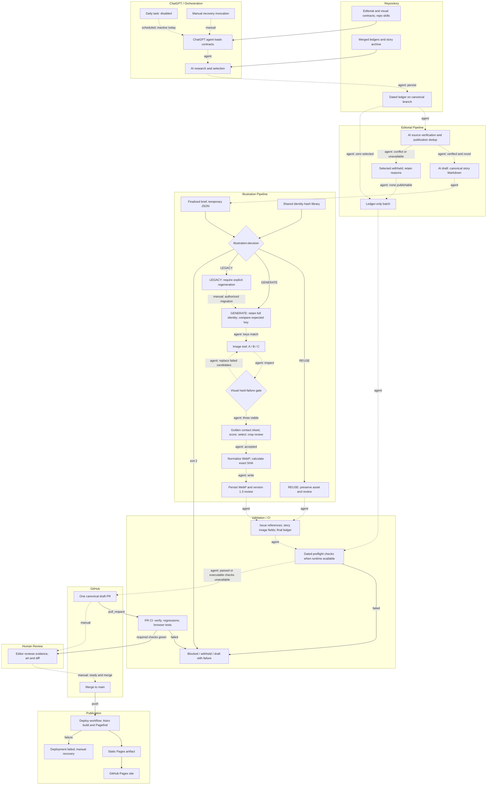
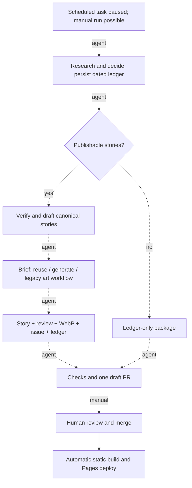

# Daily AI Pulse — current workflow audit

Audit date: **6 October 2026, Europe/Luxembourg**. Repository: `GadDev/daily-ai-pulse`. Pinned `main`: **753b9f3168d2efe90a441bc339abe54fc4e42ba6**, rechecked unchanged at the end of evidence collection. Latest merged change: PR #137, illustration-skill guidance. Scope: read-only audit; no repository edits, PR creation, generation, scheduler changes, or deployment.

## Assessment at a glance

**This is a well-structured, supervised editorial workflow with useful deterministic controls. It is not yet a reliable unattended daily production pipeline.** The biggest gaps are incomplete publication validation, validation coverage limited to the newest ledger, and orchestration state that still lives partly in agent instructions and temporary files.

The live recurring orchestrator is **disabled**. Its last recorded run was **5 October 2026, 07:13:07 UTC / 09:13:07 Luxembourg**. Its configured schedule is daily around 08:00, with `flexible_schedule` and `Europe/Luxembourg`; this is configuration, not proof of an exact start-time guarantee. The October 3 one-time dry run is also disabled/completed. No scheduler setting was changed during this audit.

The latest Pages deployment for the pinned `main` succeeded. That proves the static build/deployment path worked for that commit; it does not prove that daily orchestration or every publication invariant is enforced. [E1, E10, E11]

| Severity | Finding | Evidence |
| --- | --- | --- |
| 🔴 Critical | Default editorial and illustration checks inspect only the newest ledger. Older corrections, review migrations, and orphan artifacts can escape PR CI. | Both scripts call `latestLedger()` without an argument; isolated older-ledger corruption probe passes the default check. [E6, E7] |
| 🔴 Critical | Published candidates can pass editorial validation with `publication_verification: conflict` and `publication_status: duplicate-conflict`. The documented drafting predicate is not enforced. | Isolated probe passed; validator never checks these fields. [E3, E6] |
| 🔴 Critical | Story image and reviewed final asset are not bound together by the batch validators. | Both dated validators passed a fixture whose review pointed to a different existing asset from the story. [E6, E7] |
| 🟠 Important | Full-story hashing conflicts with image frontmatter finalized after illustration resolution. | PR skill steps 7–8 versus exact-byte story hashing. [E3, E5, E8] |
| 🟠 Important | `REUSE` means identity/asset match, not a fully valid review. The full batch validator remains essential. | Decision probe returned `REUSE` despite failed constitution and score; batch validator correctly rejected it. [E7, E8] |
| 🟠 Important | The recurring entry point is paused; no verified missed-run watchdog or automatic recovery exists in the inspected components. | Actual task state and repository workflow inventory. [E1, E10] |
| 🟠 Important | Installed skills and repository skills diverge substantially. | Installed PR skill uses `docs/dry-runs/` and `candidates:check`; current repository uses editorial ledgers and `editorial:check`. [E2, E12] |
| 🟡 Improvement | Three successful candidates can require more than three image generations, with no stated attempt or spend ceiling. | Illustration skill replacement loop and system regeneration rules. [E4] |
| 🟢 Healthy | Git-backed editorial memory, separate research and publication outcomes, canonical stories, human merge, shared identity library, and required PR checks are sound choices. | Implementation and GitHub ruleset. [E3–E11] |

## Evidence and limits

Use these labels throughout:

- **V — Verified implementation/state:** directly read code, current files, scheduler configuration, GitHub rules, Actions results, or executed checks.
- **D — Documented/instructed behavior:** contracts or prompts require it, but no deterministic executor was found for that transition.
- **I — Inference:** a conclusion from available evidence, stated as such.
- **U — Unknown:** not observable from the available records.

The audit read both repository skills, the installed Pulse skills, all seven pipeline scripts, current editorial/visual contracts, all 20 ledgers, all 73 story files, all 20 issue manifests, all five persisted illustration reviews, relevant reference layout and exact assets, validators, tests, package scripts, CI/deploy workflows, the actual scheduled prompts, active branch ruleset, and recent Actions results. The illustration checks needed the exact October 3 asset and golden references; the entire binary archive was not downloaded.

**Local verification:** 70 tests passed across editorial-validator, generation-identity, generation-decision, and illustration-validator suites. Both dated October 3 npm checks passed: 1 selected, 1 published, 0 withheld; 1 published illustration. Additional negative probes ran in disposable fixtures, outside the repository snapshot. The first test attempt lacked a reference image; after materializing that exact asset, the complete suite passed. That initial environment failure is not a repository defect.

The local runtime was Node **24.19.0**, whereas repository engines and PR CI specify **22.22.3**. Full `npm run verify`, local Playwright/browser rendering, contact-sheet regression, and local deployment were **not rerun**. GitHub independently records successful PR #137 CI, including contact-sheet/browser checks, and successful deployment of the pinned merge. No monetary costs, model-call logs, seeds, or full scheduler execution trace were available. Assertions about news truth or image taste were not independently re-audited for every historical story.

All five production review records at this snapshot are **version 1.2**. Version 1.3 code and tests exist, but there is **no persisted production 1.3 review** on pinned `main`. The separate October 6 migration request is authorization/history evidence, not proof that migration completed. Its `/tmp` finalized brief is not present in this workspace; this audit does not reconstruct or substitute it. [E9]

## 1. Current end-to-end workflow

The normal preparation path is one externally scheduled ChatGPT run, following repository instructions through research and draft PR creation. Skills are procedures executed by the agent; they are not independently running services. GitHub Actions performs executable validation and static deployment. There is no repository cron workflow, image worker, application database, object-storage service, or provider-specific image API client in the inspected implementation.

**Important transition distinction:** “automatic” within the scheduled preparation path means the agent is instructed to continue without a normal human handoff. It does not mean a coded state machine guarantees the transition. File writes alone do not trigger a skill. PR events and `main` pushes do trigger GitHub Actions in code. Today, the scheduled entry point is paused; manual recovery remains possible.

| Step | Trigger and executor | Inputs/dependencies | Outputs, files and owned state | Gate and next transition | Failure, retry and idempotency |
| --- | --- | --- | --- | --- | --- |
| 1. Wake and load contracts | D: ChatGPT recurring task; V: presently disabled. Human manual invocation is an alternative. | Luxembourg editorial date; saved task prompt; default-branch contracts and repository access. | Agent working context; task run timestamps. No initial repository artifact guaranteed. | D: missing required dependency stops before publication preparation. Agent continues to research. | No verified missed-run alarm, catch-up policy or bounded automatic retry. A last-run timestamp is not a completed-batch receipt. |
| 2. News discovery | D: orchestrator asks model to research with web/source access. | Primary papers, releases, repositories, technical reports and independent evidence; editorial policy. | Raw candidates and source context in the run. | D: evidence/date/engineering relevance review. Agent proceeds to selection. | Source outage or incomplete research can halt/defer. Raw research is not necessarily durable until ledger persistence. |
| 3. Research deduplication and selection | D: same agent applies decision engine. | Merged ledgers, published stories, recent issues; normalized URLs; underlying event and technical delta; topics. | Selected records in `candidates`, watch records in `watchlist`, rejected records in `exclusions`; scores, reasons, evidence, candidate keys. | D: hard editorial gates outrank score; no desk quota. Agent moves to canonical batch. | Semantic dedup remains model/editor judgment. V: code later checks earlier story source URLs, not all semantic event identity. |
| 4. Canonical branch and durable ledger | D: orchestrator uses GitHub operations. | Date, latest `main`, existing date branch/PR, normalized ledger. | `content/daily-ai-pulse-YYYY-MM-DD`; `docs/editorial/ledgers/YYYY-MM-DD.json`. | D: reuse existing date resources; never write ordinary editorial work to `main`. | Naming helps retries, but no coded date lock, atomic check/create, attempt record or merged-PR recovery policy was found. |
| 5. Publication re-verification and dedup | D: repository PR-preparation skill, within the same run. | Selected ledger records, fresh source checks, current archive. | `publication_verification.status`, `deduplication.publication_status`, `publication.withheld_selected[].id/reason`. Original research decisions retained. | D: only verified/claim-scoped and new/material-update-confirmed candidates draft automatically. | Per-candidate withholding is documented. V: these status predicates are not checked by editorial validator. |
| 6. Canonical story drafting | D: model under PR skill and editorial contracts. | Surviving candidates; evidence; editorial format/depth; Astro compatibility mapping. | `src/content/stories/<story-id>.md`, sources, body, current-site frontmatter. | V: Astro schema during build; partial regex checks before build. Agent invokes illustration procedure. | Preserve existing work on retry is instructed, not enforced by a story-input fingerprint. Rewriting story bytes can invalidate 1.3 artwork. |
| 7. Finalize visual brief | D: illustration skill derives context from stable story and declared layout. | 2–3 factual sentences; placement/layout; archetype/metaphor; at least two production references; constitution. | Exact temporary `/tmp/<story-id>-visual-brief.json`; later `review.visual_brief`. | D: complete brief before decision. V: decision CLI checks object, optional story ID, layout path and reference availability only. | A freshly reimagined brief changes identity. Missing finalized temporary brief breaks exact resumption before persistence. |
| 8. Illustration decision | V: `npm run illustration:decision` invokes `resolve-illustration-generation.mjs` and shared library. | Story bytes; canonical JSON brief; layout/reference bytes; contract versions; count; surface; exposed snapshot or null; existing review/asset. | Read-only JSON/text: `REUSE`, `GENERATE`, or `LEGACY`; reason; `expected_generation_key`; stored key; validation requirement. Nothing is persisted by CLI. | V: exit 0 for decisions, exit 2 for untrustworthy command/input errors. D: agent obeys branch and stops on exit 2. | `REUSE` prevents new image calls when key and asset hash match. `LEGACY` blocks silent migration. CLI does not fully validate review quality or brief semantics. |
| 9. Full identity preparation | D: agent calls shared identity library again for `GENERATE`. | Same frozen inputs as CLI. | Full identity object held in memory. | D: computed `generation_key` must equal CLI `expected_generation_key` before image call and persistence. | Shared algorithm avoids drift, but second computation and equality enforcement are agent orchestration. No durable decision receipt is required. |
| 10. Candidate image generation | D: illustration skill invokes available ChatGPT image tool. | Candidate A/B/C prompt variants under same facts, brief and visual contract; references/context. | Temporary A/B/C images. Provider/tool execution state is external. | D: three distinct compositions; each inspected before scoring. | Failed candidates replaced until three viable candidates remain. No coded maximum attempts, request idempotency, durable candidate checkpoint or cancellation budget. |
| 11. Visual review and winner | D: agent/reviewer inspects; V: contact-sheet script renders with Playwright Chromium. | Three compliant candidates, two or more golden references, layout/crop intentions. | Temporary contact sheet; scores; notes; selected candidate; crop approvals. | D: reject hard violations before scoring; winner needs total ≥85 and reference fit ≥80, then placement checks. | V: final selected score math and approval fields validated later. Actual candidate existence/comparison and objective visual truth are not proven by JSON. Failed batches regenerate by instruction. |
| 12. Normalize and persist illustration | D: agent uses available image processing, then shared SHA helper. No dedicated normalization/finalization command found. | Accepted winner; declared placement; frozen identity. | `public/images/stories/<story-id>.webp`; `docs/editorial/illustrations/reviews/<story-id>.json`; v1.3 identity and exact output SHA. | V: full illustration checker recomputes identity, output SHA, container length and dimensions for v1.3. Agent returns to PR prep. | Binary-safe Git blob operations required by prompt. No transaction helper guarantees that asset and review are committed together. Half-finished state must be repaired/withheld. |
| 13. Issue and publication reconciliation | D: PR skill completes image frontmatter, issue and ledger. | Stories, illustration results, original ledger decisions. | `src/content/pulse/YYYY-MM-DD.md`; updated `publication.story_ids`, withholding, optional Must Know; frontmatter image/alt. | D/V: preflight plus content/editorial/illustration checks. | Post-generation story edits change 1.3 story hash. Orphan inverse checks cover the chosen date only. Individual candidates may become withheld; all withheld yields ledger-only. |
| 14. Preflight and one draft PR | D: orchestrator/PR skill; V: npm commands available when runtime exists. | Canonical branch, intended diff, persisted ledger and artifacts, evidence tables. | At most one instructed draft PR titled `content: prepare Daily AI Pulse for YYYY-MM-DD`; validation status in body. | D: structural/editorial blockers stop or withhold. Without local executable runtime, draft PR permitted with “not run” declared. | Reuse same PR on failure/pending CI is instructed. PR uniqueness, draft status and changed-file scope are not validated by pipeline scripts. |
| 15. PR CI | V: `.github/workflows/ci.yml`, `pull_request`. | PR checkout; Node 22.22.3; npm dependencies; Chromium. | Verify and browser check results; failing Playwright report retained 7 days. | V: `npm run verify`, four Node regression suites; browser job contact-sheet regression and Playwright build/preview tests. Agent reports passed/pending/failed; draft remains draft by instruction. | CI cancels obsolete run for same workflow/ref. Browser tests retry once in CI. No automatic editorial/image repair job. Default batch checks use newest ledger only. |
| 16. Human review and merge | D: human editor reviews evidence, visuals and diff, makes PR ready, merges. V: active ruleset requires a PR and two named checks. | Draft PR, evidence and CI. | Reviewed Git change; merge into `main`. | V: strict up-to-date checks and resolved threads required; no bypass actors. Human action crosses publication boundary. | Required approving-review count is **0**: human approval is procedural, not a required independent review event. No credential segregation for an external agent verified. |
| 17. Static publication | V: `deploy.yml` on `push main` or manual `workflow_dispatch`. | `main`, npm dependencies; Astro content; Pagefind. | `dist` static site → Pages artifact → GitHub Pages deployment. | V: build job then `needs: build` deploy; `github-pages` environment. | Runs `npm run build`, not full verification. No post-deploy smoke test or explicit rollback automation found. Deployment can lag merged editorial state. |

**Zero-story path:** ledger-only is a valid outcome, including days when all selected candidates are withheld. No story, image generation, or issue is required. It still gets the canonical ledger/branch/draft PR and PR CI. After a human merge, the current deployment workflow runs even if only the ledger changed. This behavior is instructed and the zero-story validators are tested. [E1, E3, E6, E10]

### Documentation and implementation mismatches

| Claim or instruction | Actual evidence | Consequence |
| --- | --- | --- |
| Normal workflow has an editor hand the ledger to PR prep. | `CLAUDE.md` still says this; task and current repo skill own the full automatic preparation path. | Engineers can incorrectly wait for a manual handoff. |
| Workflow is configured for daily orchestration. | README describes configuration; live task is disabled. | README is not an operational status monitor. |
| Controlled live batch remains the next operational milestone. | October 3 batch exists; PR #131 merged; later P0 reconciliation was necessary. | Milestone wording is stale/incomplete; a clean v1.3 end-to-end run is still unverified. |
| Identity contract is “Proposed.” | It is wired into current CLI, validator, tests and v1.3 contract. | Status label contradicts implemented authority. |
| Installed PR skill reads `docs/dry-runs/...` and runs `candidates:check`. | Those paths/command are absent from current tree/package. | Standalone skill invocation can execute the obsolete contract. |
| Decision CLI rejects an invalid visual brief. | It rejects malformed JSON/path inputs, but accepts missing subject/context and unsupported placement. | Semantically invalid work can progress to expensive image generation. |
| `REUSE` requires a valid review. | CLI checks limited shape, identity key and actual asset SHA; full validator can reject the same review. | Must retain separate mandatory full review validation; do not interpret CLI result as final approval. |
| Validator proves required review occurred. | It checks declarations and selected score arithmetic, not candidate images, all candidate scores or comparison record. | “Attested review metadata passes” is a more accurate description. |
| Stories may use a different ID with explicit mapping; humans can override decisions. | Validator directly requires published story ID to be a selected candidate ID and rejects watch/rejected publication; no mapping/override schema exists. | Documented flexibility is not executable. Use same IDs and preserve current invariants until explicit adapters exist. |
| `CLAUDE.md` says missing dated ledgers skip. | Explicit nonexistent ledger paths exit 1; only implicit no-ledger mode skips. | Recovery guidance is misleading. |

The previously reported stale `validate-illustrations.mjs` dependency is **fixed** in the inspected repository PR skill (`validate-illustration-batch.mjs`). The task is still paused. The historical blocker is prior-context evidence; current code/path correctness and current task state are independently verified. This audit does not claim the scheduler automatically recovered.

## 2. Illustration amendments: coherent controls and loose joints

The amended design is coherent in intent. It separates generation inputs from output integrity, puts operational reuse in a command, keeps historical records honest, and introduces a deterministic validation gate. It has two distinct identities:

1. **Input identity:** `generation_key = SHA256(canonical JSON of identity fields)`.
2. **Output integrity:** SHA-256 of exact final WebP bytes, outside the generation key.

Canonical JSON sorts object keys, preserves array order and strings, and rejects unsupported values. Story source uses exact bytes. Reference identity includes the ordered layout path/hash followed by golden reference path/hashes. Versions, candidate count, generator surface and an exposed exact model snapshot are input identity fields. Timestamp, scores, winner, asset hash, Git commit, branch, PR, CI and scheduler run are excluded. This separation is healthy: retries should not become stale merely because a PR changes. [E5, E8]

| Control | What implementation proves | What it does not prove | Assessment |
| --- | --- | --- | --- |
| Finalized brief | Canonical content can be hashed and is embedded in persisted review. | Brief matches a frozen earlier invocation; context sentences are true; pre-persistence `/tmp` state survives. | Useful; persist once and reuse exact brief on retries. |
| `expected_generation_key` | CLI recomputes expected inputs from current repository. | Agent later persisted the original decision output rather than a recomputed substitute. | Return full identity/receipt once; compare at finalization in code. |
| `generation_key` | v1.3 checker recomputes exact current story/brief/reference inputs and versions. | Model really consumed that context or prompt, or produced that output. | Strong consistency mechanism, limited provenance attestation. |
| `REUSE` | Matching stored key and exact final asset hash, with basic shape. | Review passes constitution/scoring/crop; WebP decodes; incomplete review is complete. | Correct narrow cache predicate; mandatory subsequent validation required. |
| `LEGACY` | Existing `system_version: 1.2` produces a distinct branch. | Old review/asset is visually valid; human override has a durable authorization record. | Good backward compatibility. |
| Migration/regeneration | Prompts require explicit human request; do not fabricate identity. | CLI has a migration/force-authorization input or validates that authorization. | The skill says step 5 runs only after `GENERATE`, yet explicit legacy/REUSE overrides can proceed; branch exception is insufficiently specified. |
| Three candidates | JSON `candidate_count` is an integer ≥3; selected candidate A/B/C. | Three candidates existed, were distinct, all scored, or winner scores equal selected candidate scores. | Candidate policy is stronger than schema enforcement. Exactly three is instructed, ≥3 is validated. |
| Constitution | Required flags false; pass true; no unresolved violations/hard failures. | Image lacks forbidden content; review was honest or independent. | Appropriate visual judgment boundary, describe it as attestation. |
| Golden comparison | At least two distinct existing production paths; fit ≥80. | Side-by-side sheet exists; comparator used actual references; documented comparison evidence retained. | Valuable art control; temporary evidence weakens audit. |
| Scores | Selected component ranges, threshold and weighted arithmetic validated. | Objective taste, candidate comparison, maximum score selection, score independence. | Keep one rubric, remove arithmetic from model responsibility. |
| Crops | Declared placement/crop, approval booleans and output size/aspect constraints. | Actual responsive focal preservation; normalization did not stretch; all declared roles reviewed. | Human/vision assessment remains necessary. |
| WebP/integrity | Complete RIFF declared length/chunk boundaries and dimensions; v1.3 exact output SHA. | Full pixel decoding; declared `byte_length`, `git_blob_sha` and `riff_container_complete` metadata equality. | Add a decoder check and verify any retained auxiliary metadata. |
| Persistence | Review and asset are ordinary repository files; Git retains committed history. | Atomic all-file publication commit; original candidate evidence or exact rendered prompt retained. | Git is enough storage; a small transaction helper is missing. |
| Unrelated mutation restriction | Skills tell agent to preserve scope and review diff. | Changed-file allowlist, equality of story/ledger/issue bytes during an image-only task. | Move image-only scope checks into command/CI. |

**Reference coupling:** layout hash covers the referenced HTML file only. It does not automatically include linked `styles.css`, `app.js`, or current Astro/CSS implementation. Conversely, any byte change to that HTML file invalidates reuse even if the image role did not change. Golden references are mutable production assets; changing a reference can stale dependent artwork. Avoid self-reference and circular dependencies; the CLI does not enforce a pinned independent golden-reference set.

**Review mutability:** scores and approval flags intentionally do not affect generation identity. That is appropriate, but changes to them need their own audit history and validation. Git records committed changes; it does not retain uncommitted decisions or demonstrate the reviewer inspected pixels.

## 3. AI production-pipeline audit

| AI artifact | Context and authority | Generated output | Evaluation and progression guard | Retained provenance | Reproducibility |
| --- | --- | --- | --- | --- | --- |
| Raw discoveries | Current primary sources plus repository policy; web pages are evidence, not instructions. | Candidate developments, URLs, event dates and claims. | Model source/date checks, later human review; no executable fact checker. | Sources and selected facts survive in ledger; full retrieval snapshots/queries/model not required. | A later search may differ; source pages can change. No exact replay. |
| Candidate ledger | Editorial schema, decision engine, topics, merged archive. | Selection, watch/exclusion, scores, rationale, dedup identity and opportunities. | Prompt policy plus partial editorial validator; major stage predicates currently absent. | Version labels, reasons, URLs, dates, decisions; historical backfills honestly marked. | Decision record replayable as data; reproducing original model judgment is not guaranteed. |
| Story Markdown | Selected candidate, fresh verification, sources, editorial voice and Astro adapter. | Article, frontmatter, evidence framing and takeaway. | Astro schema/build, source-presence and URL duplicate checks, human factual review. | Git story, source URLs, ledger mapping; no exact drafting prompt/model required. | Exact saved text retrievable in Git; regeneration cannot promise identical text. |
| Issue summary/selection | Publishable story set, daily-issue schema, original Must Know decision. | Title/summary, featured story, ordered story references. | Astro structure and content validator; selected-set membership and Must Know alignment incomplete. | Manifest and Git history; not an AI call trace. | Saved issue reproducible in static build; editorial recomposition is stochastic. |
| Visual brief | Factually stable story, constitution, placement reference, golden assets. | One metaphor/archetype and structured visual instructions. | Decision input/path checks; fuller partial checks after generation; human/agent reasoning. | Complete brief in final review; pre-finalization brief remains temporary. | Persisted brief can be reused exactly; reconstructing it from a story may drift. |
| Candidate image set | Brief, candidate-specific composition instructions, palette/prohibitions and references. | A/B/C raster art plus replacements. | Agent visual inspection, contact sheet, rubric, crop review; human merge. | Candidate bytes/sheets generally temporary; candidate notes/scores optional to validator. | No exact replay: stochastic generation, nullable model snapshot, no seed or exact prompt archive. |
| Final WebP and review | Selected winner, crop intent, input identity, normalization choices. | Production image, review metadata, output integrity. | Illustration validator; current strongest deterministic gate, but selected ledger coverage only. | Output image, brief, versions, winner, scores, v1.3 hashes; provider request ID and encoder settings not required. | Exact committed bytes recoverable. Producing the same bytes from generator is not guaranteed; normalization replay also lacks a mandated recipe. |
| PR explanation | Ledger, diff, evidence, illustration result and validation statuses. | Reviewer tables and operational outcome. | Human review; no machine validation of body completeness or declared test results. | GitHub PR text/comments/Actions. | Reviewable narrative; not a substitute for authoritative artifacts. |

The system is **artifact-reproducible**, not **model-reproducible**: Git can recover saved text/images, and a pinned toolchain can rebuild a site; it cannot recreate the original search, judgments, candidate outputs or exact image from their retained metadata. `model_snapshot: null` is honest and intentional. A generation key prevents avoidable duplicate work; it is neither a model seed nor proof of execution.

**Resumability:** good after a complete valid Git commit; weak between generation and persistence. A crash after two expensive candidates but before review persistence leaves no durable checkpoint. A retry can rebuild a different brief or repeat all calls. “Resume from repository” is a useful procedure, but no executor records phase progress or owns partial-failure repair.

**Human boundaries:** the agent is told never to merge, auto-merge or mark ready. GitHub requires a PR and both CI jobs, but requires zero approving reviews. Independent editorial approval and agent-versus-human credential separation were not verified. This is a control gap if the intended policy is technically enforced human approval; it is not proof that this workflow has bypassed human review.

**Untrusted source handling:** inspected prompts constrain factual invention, but do not explicitly say that external articles/releases cannot issue workflow instructions. I found no coded separation between retrieved evidence and orchestration authority. Adding that explicit boundary is warranted for this tool-enabled agent, without turning the publication into a security platform.

## 4. Prompt-engineering audit

### Important prompt surfaces

| Surface | Useful responsibilities | Drift, repetition or ambiguity |
| --- | --- | --- |
| Saved recurring task | Wake, resolve date/repo/contracts, delegate stages, preserve review boundary and report outcome. | Restates selection schema, branch/PR rules, withholding, verification, image/issue paths and preflight already in repo. Changes cannot be versioned/reviewed through repo alone. |
| One-time October 3 task | Controlled date and at-most-one-batch identity. | Mostly repeats recurring prompt; completed test task should not become another production policy source. |
| Repo PR-preparation skill, 4,526 words | Editorial reasoning, evidence recheck, withholding, drafting and review presentation. | Repeats contracts and illustration ownership; ambiguous already-merged PR recovery; image-frontmatter timing conflicts with identity. |
| Repo illustration skill, 3,464 words | Translate facts to metaphor; guide candidate creation and visual review; follow CLI results. | Repeat prohibited lists and rubric; double identity computation; `LEGACY`/force overrides conflict with “only after GENERATE”; reconstructed brief on retry can drift. |
| Illustration-system contract, 3,695 words | Canonical review policy, authority, placement and quality requirements. | Describes reuse algorithm separately from newer CLI skill, omits operational LEGACY branch in the older two-outcome sequence; overstates what validator proves. |
| Identity contract, 2,534 words | Exact input identity and historical compatibility. | Still “Proposed”; prompt/constitution content represented by version strings, so correctness relies on disciplined version bumps. |
| Visual constitution | Art direction, prohibitions, placement, single-idea rule. | Essential instructions must reach generator; copies in system/skill/prompt can drift. Fine lines versus editorial physicality is clarified, not inherently contradictory. |
| Installed skill copies | Older art and PR procedures. | Current canonical ledger/commands, three-candidate review and identity controls absent. Explicit standalone invocation can select stale skill. |
| Generated A/B/C prompts | Creative composition variants under same verified facts. | Exact rendered prompts/variant rules not required in review; V1 hashes a prompt-contract version rather than actual prompt bytes. |
| README and `CLAUDE.md` | Navigation and developer mental model. | CLAUDE still documents a manual handoff and incorrect skip behavior; README does not expose actual paused task state. |

The four large skill/system/identity documents above total **14,219 whitespace-separated words**, before constitution, editorial contracts, sources, stories or visual inputs. This is a context-footprint indicator, **not a measured token count**. Re-reading that policy for every story can be expensive. Repeating constitutional instructions inside each actual image prompt is useful; repeating the entire procedure across orchestrator, skill and contract is mostly maintenance cost.

### Responsibility classification

| Instruction/rule | Primary owner | Current enforcement | Recommended boundary |
| --- | --- | --- | --- |
| What changed, significance, claim scope, metaphor, style | Prompt + human review | Model judgment and editor | Keep AI-driven with concrete acceptance criteria. |
| Date/ID/path/branch identity; one batch | Code | Mostly prompt; partial filename checks | Deterministic resolver and branch/PR lifecycle checks. |
| Candidate fields, versions, disjoint buckets, withholding shape, topics | Schema | Handwritten partial checks | Explicit stage-aware schema, allowlisted versions and type checks. |
| Verification/dedup predicate before publication | Code + CI | Prompt only for statuses | Validate exact documented boolean predicate. |
| Identity key, SHA, normalized dimensions, score math | Code | Shared hash library; score math in validator; normalization ad hoc | Compile once, deterministic finalization and derived totals. |
| Three candidate comparison, composition distinction | Prompt + human review; schema for evidence | Candidate count declaration and selected scores | Persist a bounded review manifest, candidate hashes and comparison evidence. |
| No forbidden pixels, factual visual honesty, useful alt and crop | Vision review + human review | Self-reported flags and booleans | Code checks evidence completeness, human checks actual art; avoid pretending booleans prove pixels. |
| No story/ledger/issue mutations in image-only work | Code + CI | Prompt/diff inspection | Exact allowed-path and before/after digest checks. |
| PR remains draft, no auto-merge, human publication | GitHub permissions/rules + human | Instructions; PR/two checks enforced | Restrict automation capabilities where possible; encode approval policy if required. |
| Retrieval cannot override workflow rules | Prompt/system boundary | Not explicit in inspected task/skills | Treat source content as untrusted evidence, never executable workflow instructions. |

## 5. Performance and efficiency

No execution trace establishes the actual number of text-model calls, source fetches, tokens or billed image calls. The task has logical phases, not one measurable model call per phase. Normal `GENERATE` calls request **at least three candidate images**; replacement loops can exceed three. `REUSE` calls request zero images by instruction. The scheduled prompt’s “one primary illustration” refers to one final publication asset, not one image-generation call.

| Expensive operation | Cost → value | Avoid/cache? | Earlier or later? |
| --- | --- | --- | --- |
| Research/source retrieval | Unknown browsing/model latency → current evidence and discovery | Cache source snapshots, canonical URLs and retrieval time; recheck important mutable claims before publication. | Keep before drafting/art. |
| Archive scanning | Repeated read/context cost → duplicate prevention | Deterministic source/event index keyed by repository SHA; model reviews ambiguous deltas only. | Early research check plus focused publication recheck. |
| Policy reads per story | Large text/visual context → consistent behavior | Load once per immutable repository snapshot; compile small stage inputs. | Before any expensive model work. |
| Re-verification after selection | Extra source reads → catches changing or overstated claims | Reuse recent evidence with explicit freshness conditions; do not eliminate the gate. | Before drafting and image generation. |
| Three composition candidates | ≥3 image outputs → visual choice and archive consistency | Existing identity reuse avoids all; reducing new candidate count requires deliberate policy change and new identity. | Only after schema, publication and brief checks. |
| Replacement candidates | Unbounded image work → compliant final choice | Bounded attempts and per-story spend/time budget; preserve viable candidates. | Stop/defer once budget exhausted; do not silently lower quality. |
| Golden contact sheet | Image encoding, Chromium startup → direct visual comparison | Reuse accepted review on retries; batch rendering in one browser; persist small receipt/sheet if needed. | After candidate hard gate, before winner selection. |
| Crop review | Multiple render/vision inspections → legible real placement | Generate deterministic crop previews together; one review of original plus final normalized output. | Cheap composition crop filter before scoring; final check after normalization. |
| Full story/reference hashing | File reads → stale-input detection | Cheap relative to generation. Cache reference digests by immutable Git blob; preserve recomputation at trust boundary. | Before image generation and final validation. |
| WebP normalization | Encode/resize work → small production asset | Deterministic recipe; do once for winner. | After selection; do not normalize every candidate unnecessarily. |
| Dated checks plus `verify` | Cheap checks repeated locally → chosen date plus global build correctness | A unified explicit scope avoids redundant newest-date checks. Keep CI verification at independent boundary. | Cheap gates before lint/build and before art. |
| Two PR jobs build separately | npm install twice, type/build twice, Chromium install → independent validation/browser confidence | Consider artifact sharing only if timings justify added coupling. | Current cost is modest; prioritize correctness. |
| Ledger-only merge triggers full deploy | Static rebuild for non-rendered editorial memory → little reader value | Conditional publish only for site-affecting changes, with safe path rules. | P2 after correctness; do not weaken PR gates. |

Observed PR #137 timings: Verify job approximately **33 seconds**, browser job **82 seconds**. Chromium installation took about **33 seconds**; browser suite step about **18 seconds**. Its `verify` step took about **14 seconds**. Latest merge deployment had a **23-second build job** and **12-second deploy job**, excluding queuing. These are single-run observations, not averages, costs or SLAs. [E11]

### Is the illustration sequence right?

The current intended sequence is already better than “generate then validate”: it freezes a brief, resolves reuse, rejects constitutional failures before scoring, compares references, scores, checks selected crop, normalizes, persists and validates.

The expensive mistake is **incomplete cheap validation before `GENERATE`**. Validate publication eligibility, complete brief semantics, distinct reference paths, allowed crop and output path first. Then decide reuse. Keep hard visual checks before scoring and crop checks around selection/normalization.

Three candidates are defensible for prominent editorial art and a developing visual language. There is **no measured evidence** that three is always the best daily cost/quality trade-off. The strict requirement to refill the set to three viable candidates and regenerate whole batches without a ceiling is less proportionate than the initial three-way choice. Preserve current policy until a reviewed change; measure rejection rate, attempts, selection benefit and editorial time before changing it.

## 6. Reliability and failure matrix

“Current recovery” below describes instructions unless explicitly marked executable.

| Stage | Failure | Detection | Current recovery | Risk | Recommended improvement |
| --- | --- | --- | --- | --- | --- |
| Scheduler | Never runs, paused or missed | Task state/last timestamp; no verified watchdog | Manual inspection/recovery; task currently paused | High: no batch and no GitHub CI to notice | Expected-date completion receipt and missed-run alert; controlled resume after blockers fixed. |
| Contract load | Required file missing/stale | Read failure; historically wrong validator path | Stop, report dependency; no PR | Medium: hard stop is safe, but can persist indefinitely | Preflight dependency manifest and smoke check; versioned bootstrap. |
| Discovery | Search/provider/source outage | Agent/tool error or source-unavailable judgment | Defer/watch/stop and report | Medium: incomplete coverage or lost raw work | Persist research checkpoint; bounded retry for transient errors. |
| Existing ledger | Date ledger/branch/PR exists | Prompted resource lookup | Reuse existing batch | High with concurrent runs or already-merged date | Coded lifecycle resolver, expected-head guard and date lock. |
| Duplicate selection | Same event under new URL | Agent semantic check; code only earlier URL collision | Withhold selected, preserve reason | High: semantic/new-URL duplicates can pass | URL/event index plus explicit publication status enforcement. |
| Ledger | Malformed structure/statuses | JSON parsing and partial validator | Repair same branch; preserve decisions | High: some malformed/status-conflicting data pass | Stage-aware schema and complete predicate/partition checks. |
| Story | Generation fails/unsupported claims | Agent review, schema/build, human | Retry or withhold on same branch | Medium: exact evidence context not checkpointed | Persist verified source record and stable draft checkpoint. |
| Brief/decision | Brief changes after decision | v1.3 recomputed hashes; agent equality requirement | Stop and rerun decision | High before expensive call; later mismatch wastes candidates | Persist decision receipt and frozen brief before image calls. |
| Generation identity | Key differs from expected | Skill equality check; current identity validator | Stop; never choose convenient key | High: no persisted original expected-key receipt | Return full identity and validate original receipt at finalization. |
| Image generation | Tool call fails | Tool output/error | Retry/regenerate by procedure | High cost; no retry budget | Bounded retries, per-attempt IDs and durable candidate manifest. |
| One candidate | Forbidden motif/crop failure | Agent individual visual inspection | Replace until three compliant candidates | Medium/High: unbounded work | Keep successful candidates; cap replacements; record rejection reason. |
| Scoring | No eligible winner or malformed scores | Model review; selected score arithmetic in checker | Regenerate batch | Medium: all-candidate evidence optional | Compute totals in code; persist candidate matrix; bounded defer. |
| Normalization | Crop/stretch/encode fails | Visual review; dimensions/RIFF, not full decode | Repair asset or regenerate | Medium: malformed codec payload could pass header checks | Decode final output; fixed normalization recipe and final crop preview. |
| Asset integrity | WebP changes/corrupts | v1.3 actual SHA mismatch; v1.2 lacks enforced SHA | `GENERATE` or explicit legacy repair | High if affected date not checked | Validate affected/all active dates and output binding. |
| Persistence | Asset, review, ledger or issue only partly saved | Date-scoped forward/inverse checks; CI if right date | Repair same branch or remove/withhold partial set | High: no write transaction | Stage complete set, validate, commit one tree with expected-head guard. |
| Scope | Image task changes story/ledger/unrelated files | Agent diff review only | Restore/repair by human/agent | High: invalidates input or unrelated state | Command/CI allowed-file and unchanged-byte checks. |
| PR creation | Never opened after work saved | Run final report; no independent completion monitor | Find branch, manually continue | High operational visibility gap | Durable run outcome and branch-without-PR alarm. |
| PR identity | Two PRs/runs for date | Prompted pre-existing lookup | Reuse PR; no coded uniqueness gate | Medium: races and merged-state ambiguity | Resolver plus date lock, clear merged/rejected/correction policy. |
| CI | Validation/build/browser fails | Required Actions jobs | Keep draft; repair/rerun same PR | Medium: old-date violations may evade default gate | Validate changed date closure or all non-backfill ledgers; retain required checks. |
| Human review | PR forgotten or merged without independent review | GitHub PR state; no stale-review alarm | Manual editorial decision | Medium: blocked cadence or missed editorial oversight | Review queue age alert; encode intended approval policy. |
| Publication | Merge succeeds; build/deploy fails | Actions failure | Manual rerun or corrective/revert PR | High: Git ledger says drafted/published while site stays old | Distinguish prepared/merged/deployed status and alert on failed deploy. |
| Published site | Deployment succeeds but page/asset is wrong | No post-deploy live probe found | Manual inspection | Medium: static build success is narrower than live success | Tiny live smoke test for latest edition and asset. |

**Single points of failure:** the one paused external orchestrator for automatic preparation; agent-held brief/identity/candidate context between durable commits; GitHub repository/API for editorial memory and handoff; image tool for new artwork; human merge for release; one Pages deployment path for delivery. Some are appropriate at this scale. The problem is missing completion detection and recovery contracts, not the mere use of one service.

## 7. Component responsibility map

| Component | Responsibility | Inputs | Outputs | State owned | Should it own this? |
| --- | --- | --- | --- | --- | --- |
| ChatGPT scheduled task | Wake, date, bootstrap contracts, continue stages, report outcome | Saved prompt, schedule, repository | Agent run and draft batch/PR | Enabled state, schedule, last run | Yes for wake/bootstrap; detailed business policy should be delegated. |
| PR-preparation skill | Publication verification, drafting, issue/batch coordination, review presentation | Selected ledger, evidence, repo contracts | Story/issue/ledger updates, draft PR | No autonomous database; procedural working context | Yes; deterministic transition rules should be code. |
| Illustration skill | Metaphor/prompt construction, visual judgment, obey CLI, coordinate art | Stable story, brief/layout/constitution | Reviewed image/review or unchanged reusable asset | Temporary candidates and decision context | Yes for creative reasoning; no separate identity/reuse algorithm. |
| Repository scripts | Hashing, decision, declared-quality and relationship validation, contact rendering | Files, CLI args | Decisions, check results, sheet | No job/run database | Yes; extend existing scripts rather than add infrastructure. |
| Ledger | Research decision memory and publication artifact membership | Candidates and downstream outcomes | Durable dated JSON | Decisions, sources, scores, withholding/story IDs | Yes; not image execution logs or actual deployment completion. |
| Story Markdown | Canonical editorial content and current-site metadata | Verified selected candidate | Article/source/image references | Text, frontmatter, corrections | Yes; full file also used as image input fingerprint, causing coupling. |
| Visual brief | Exact generation intent | Story facts, role, art policy and references | Structured context/metaphor | Temporary file then nested review object | Yes; should be frozen durably before expensive work. |
| Illustration decision | Current reuse eligibility | Repository + exact brief/config | Read-only outcome and expected key | None currently | Yes; should output full identity/receipt rather than require reconstruction. |
| Image-generation system | Produce stochastic raster candidates | Rendered prompts/reference inputs | Images or tool errors | Provider-side execution state, not Git batch | Yes; should not make publication decisions. |
| Illustration review | Accepted visual outcome and input/output evidence | Brief, identity, visual inspection, winner | Versioned JSON | Scores, approvals, identity and asset metadata | Yes; currently not a durable full candidate audit. |
| GitHub | Versioned files, branches, draft PR, review and merge | Prepared Git change | Durable history and review surface | Git objects, refs, PRs/rules | Yes; a tree commit can be transactional but current procedure does not require a helper. |
| GitHub Actions / CI | Independent executable gates | PR checkout and toolchain | Required checks, test reports | Run statuses/artifacts | Yes; must validate intended batch dates. |
| Human reviewer | Factual/editorial judgment, actual visual quality, deliberate overrides and release | Evidence, images, diff, CI | Acceptance/corrections/merge | Review comments and explicit decisions | Yes; approval record should match intended policy. |
| Publication process | Build/index/deploy static site | Merged `main` | Pages artifact/site | Deployment run/environment | Yes; success should feed operational completion status. |

**Responsibility leakage:** publication eligibility is asserted by task, contract and skill but absent from code; visual prohibitions and rubric duplicated across four layers; the full identity is recomputed by the agent after a deterministic CLI already computed it; image frontmatter belongs to PR prep but mutates the file used by illustration identity. Conversely, shared code in CLI and validator is healthy reuse, not duplicated policy.

## 8. Workflow smells

| Classification | Smell | Specific observation |
| --- | --- | --- |
| 🔴 Critical | Validation checks a different batch | `verify` silently uses newest date, including on an older-date migration PR. |
| 🔴 Critical | Prompts function as publication business logic | Verification/dedup statuses and rich ledger schema are not gate predicates. |
| 🔴 Critical | Artifact relationships incomplete | Reviewed final image need not equal story image; manifest membership is checked by raw string inclusion in editorial script. |
| 🟠 Important | Hidden/transient state | Frozen brief, full identity held in memory, candidates/contact sheet temporary. |
| 🟠 Important | Claimed automation versus live state | Normal schedule paused; no missed-run watchdog found. |
| 🟠 Important | Sources of truth drift | Installed versus repo skills; CLAUDE manual handoff; Proposed identity label. |
| 🟠 Important | Too much coupling | Any story byte/formatting/image-alt edit or mutable reference change can stale artwork. |
| 🟠 Important | Non-atomic operations | Check-existing/create branch/PR and multi-artifact persistence governed by procedure. |
| 🟠 Important | Incomplete early validation | Decision CLI accepts semantically incomplete briefs before expensive work. |
| 🟠 Important | Approval boundary mostly instructional | Required checks exist, independent approving review count is zero. |
| 🟡 Improvement | Giant overlapping procedure | >14,000 words across four central documents, plus task and constitution. |
| 🟡 Improvement | Fragile ID conventions | Orphan detection uses date filename prefixes; explicit different-ID mapping is not implemented. |
| 🟡 Improvement | Review evidence thinner than claims | Candidate data optional; JSON booleans cannot prove actual visual inspection. |
| 🟡 Improvement | Observability concentrated in final report | No required run ID/phase timing/cost/error/completion manifest. |
| 🟢 Healthy | Quiet days stay quiet | Ledger-only and withholding preserve editorial integrity. |
| 🟢 Healthy | Canonical publication units | Story body is single source; issue references stories. |
| 🟢 Healthy | Historical honesty | Backfills and v1.2 reviews do not fabricate original provenance/identity. |
| 🟢 Healthy | Shared deterministic identity | One hash library; output integrity separated from inputs. |
| 🟢 Healthy | Independent checks and human release | Required PR checks, draft preparation, versioned review surface. |

## 9. Detailed CURRENT workflow diagram

**Legend:** solid arrows are coded automatic transitions or data dependencies; dotted arrows labelled **agent** are model-directed continuation prescribed by prompts; dotted arrows labelled **manual** require a person. The schedule branch is disabled at audit time. Failure nodes represent currently reported/blocked states, not new recovery services. No proposed future worker/queue is shown.

The LEGACY-to-generation arrow is a documented human exception; the current CLI has no override flag and the skill’s “step 5 only after GENERATE” wording needs reconciliation. The diagram shows the intended exception without pretending it is encoded. `J` may modify story bytes after `P`, which is the identified 1.3 identity-ordering risk.

## 10. One-minute mental model

The conveyor has a paused start button, an AI editor preparing the package, and two real locks: required PR checks and a human-controlled merge. Artwork has its own cache decision; an old file alone does not satisfy it.

## 11. Architecture assessment

### What is working well

Git is a practical durable store for a small static publication. Canonical stories and referenced issue manifests avoid content duplication. Ledgers retain rejected/watch decisions and separate immutable research decisions from downstream withholding. Historical backfill and legacy-review exceptions are explicit. Input identity and output hash are correctly separated. Shared canonicalization/hashing is tested. The added inverse checks are a real improvement over only checking that ledger-declared files exist. PR checks are required and draft work stays reviewable. These choices should remain.

### What became too complicated

The agent reads a long procedural stack, creates a temporary brief, gets a key from the CLI, calls the same library again, manually verifies equality, holds identity in memory, generates/replaces candidates, produces a temporary browser sheet, manually writes review JSON, then reconciles publication files. Most of that complexity is orchestration glue, not necessary editorial judgment. Replace the glue with a few commands; do not add a new platform merely to coordinate files.

### What is fragile

The paused task has no verified missed-run alarm. In-flight image work is temporary. A fresh retry can alter the brief. Full-story hashing makes post-image alt-text edits stale. Mutable golden references propagate invalidation. A check can validate the wrong date. Existing merged PR handling and concurrent runs are unspecified. Publication state is prepared-artifact membership, not proof of live deployment.

### What is duplicated

Branch/PR identity, publication predicates, visual prohibitions, placement mappings and scoring policy recur in task, skills, contracts and code. Some repetition is necessary at a trust boundary: independent CI must revalidate, and image prompts must carry art rules. The avoidable duplication is multiple prose procedures, obsolete installed skills and agent arithmetic/reconstruction after deterministic commands.

### What should become deterministic

Ledger schemas and stages; publication eligibility and complete selected disposition; candidate/story/asset/issue bindings; validation date coverage; one-date resource lifecycle; freeze/finalize identity; score arithmetic; normalization/integrity; transactional file scope; run completion and bounded retry budgets. Identity hashes cannot substitute for those relationships.

### What should remain AI-driven

Discovering developments, assessing significance and evidence boundaries, semantic material-delta judgment, choosing editorial treatment, clear article writing, converting facts into a visual metaphor, meaningful composition variants and comparative visual assessment. Human review should retain final editorial and visual acceptance, especially where JSON can only attest judgment.

## 12. Recommendations — after current-state reconstruction

These are targeted improvements to the existing architecture, not a replacement design. None were implemented during this audit.

| Priority / recommendation | Current problem | Proposed change | Expected benefit | Complexity | Risk | Backward compatibility |
| --- | --- | --- | --- | --- | --- | --- |
| **P0. Validate every affected batch** | Default CI only checks latest ledger; older migration/correction can go green unchecked. | Add explicit `--all` active-ledger mode or derive changed date plus dependency closure; CI must not silently default to newest. Preserve documented backfill exception. | Covers older artifact changes and dependent v1.3 references. | Low–medium | Existing hidden failures may surface. | CLI can remain additive; stricter CI intentionally rejects bad old changes. |
| **P0. Enforce publication schema and predicate** | Conflict/duplicate-conflict and unsupported ledger states accepted. | Stage-aware JSON/Zod schema; version allowlist; bucket/decision consistency; uniqueness; every selected candidate either published or withheld; require exact verified and new/material-update-confirmed status for published records. | Green check means permitted publication state. | Medium | Older records need explicit provenance adapters; avoid fabricated historic evidence. | Preserve historical backfill and legacy formats deliberately. |
| **P0. Bind the publication artifact graph** | Story image differs from reviewed asset; issue membership only partly checked; ID mappings/overrides unclear. | Parse actual frontmatter; assert candidate/story ID mapping, canonical output path, story image equals review asset; parse issue IDs and enforce batch/allowed retained references; validate Must Know, unique membership and withholding reasons. | Prevents reviewed/published split state and wrong images. | Medium | Exposes existing exceptions; structured correction needed. | Add explicit adapters for legitimate standalone/retained historical stories. |
| **P0. Freeze story before identity** | PR prep finalizes image fields after whole-story hash. | Under V1, finalize all bytes before decision; expose code finalizer that compares current input hashes to a frozen receipt and rejects late edits. Document truthful planned alt versus actual-image review and required restart if altered. | Prevents identity failure after expensive art. | Low–medium | Some honest alt corrections require renewed decision/work under V1. | No identity algorithm change; current 1.3 contract preserved. |
| **P0. Transactional finalization and image-only scope** | Multi-file writes and scope rely on agent. | Stage complete asset/review/issue/ledger set, validate, write one Git tree/commit with expected-head guard; image-only mode allows only target WebP/review and asserts other bytes unchanged. | Partial persistence cannot masquerade as complete batch; prevents unrelated mutations. | Medium | Git/API conflicts must fail safely. | Existing paths and reviews retained; new helper is additive. |
| **P0. Operational recovery and approval boundary** | Task paused; no completion watchdog; human approval only procedural. | Verify fixed dependency and run one controlled v1.3 batch before separately resuming schedule; record expected-date terminal outcome and alert on absence/failure. Decide intended approval rule and restrict automation merge capability where supported. | Restores cadence safely and detects silent loss. | Low–medium | Automatic resume without proving image/tool access could repeat failure; stricter approval may need another reviewer. | Artifact formats unchanged; changes operational policy. Do not resume as part of this read-only audit. |
| **P1. One deterministic illustration compilation result** | CLI computes identity, agent recomputes it, equality check is manual. | Return full identity and a frozen structured receipt from decision command; finalizer consumes it and exact brief. Keep one shared hash implementation. | Less context and glue; direct expected-key enforcement. | Low–medium | Receipt must be validated, not blindly trusted after inputs change. | Add fields/output mode; preserve existing CLI consumers. |
| **P1. Early brief schema and honest decision result** | Semantically invalid brief returns GENERATE; REUSE mistaken for full review approval. | Validate placement, context, metaphor/archetype and distinct references before paid work; either validate review in resolver or make reuse eligibility explicitly distinct from completed validation. | Avoids expensive doomed generations and misleading completion. | Low–medium | Tight schema can reject historical abbreviated briefs; handle LEGACY separately. | Additive for new briefs; legacy remains explicit. |
| **P1. Reconcile legacy/force override path** | LEGACY/REUSE override authorization is outside CLI and contradicts step-5 guard. | Explicit structured regeneration mode with reason and human authorization reference; compute current identity normally, preserve historical record in Git, never relabel old generation. | Clear auditable exceptional transitions. | Low–medium | Must not turn retries into automatic forced regeneration. | Preserve ordinary REUSE/GENERATE/LEGACY semantics. |
| **P1. Consolidate prompt/policy ownership** | Saved task, installed skills, repo contracts and CLAUDE drift. | Short task bootstrap pointing to versioned orchestration contract; installed skills load canonical repo skill or are aligned; one machine-readable placement/rubric/schema; fix stale doc statuses. | Less token load and fewer contradictory instructions. | Low–medium | Missing contract access still needs safe stop behavior. | Editorial behavior unchanged if contracts preserved. |
| **P1. Bounded candidate review evidence** | Unlimited replacement loop; candidates/sheet transient; review occurrence unprovable. | Attempt/time/spend ceiling; retain viable candidates through retry; persist candidate hashes, prompt/variant record, all scores/rejections and a comparison receipt or thumbnail sheet. | Resumable paid work and useful audit trail. | Medium | Adds storage; retention/privacy should be minimal and explicit. | Optional on 1.2; required under a new review contract version if schema expands. |
| **P2. Cache policy and archive evidence by SHA** | Repeated full reads/index scans. | One pinned contract bundle per run; source/event index and reference hash cache keyed by Git objects; fresh source checks only where necessary. | Lower context/retrieval latency. | Low–medium | Stale cache if key omits dependencies. | Transparent; keep independent final validation. |
| **P2. Versioned semantic identity only after measurement** | Exact-byte story/reference hashing overinvalidates artwork. | Measure unnecessary regeneration first; if material, define Identity V2 for generation-relevant story facts/roles and pinned golden inputs, with migration policy. | Reduces formatting/metadata-driven paid regeneration. | Medium–high | Can miss meaningful changes if normalization is too aggressive. | V1 reviews remain supported; never silently change V1 hash semantics. |
| **P2. Placement-aware contact and crop previews** | Contact sheet always frames images 16:9 even for square placements. | Accept declared placement/crop; show native/aspect-preserving candidate plus desktop/mobile/thumbnail previews; normalize winner with recorded encoder parameters and decode check. | Faster reliable comparison for actual role. | Low–medium | New renderer dependencies or output diffs. | Keep old review artifacts valid; new generation uses upgraded renderer. |
| **P2. Optimize CI/deploy only when justified** | Two PR builds and ledger-only deployment. | Measure rolling duration first; optionally reuse build artifact for browser and skip deploy for truly non-site changes. Keep all required validity checks. | Modest runner savings. | Low–medium | Path filters/artifact coupling can miss builds. | Additive optimization; correctness takes precedence. |
| **P3. Run manifest and recovery guide** | Final prose is principal orchestration observability. | Record date/run/phase, input SHA, attempt count, elapsed time, errors, validation result, branch/PR and terminal outcome; document paused/partial/merged-date recovery. | Debugging without reconstructing conversation state. | Low–medium | Avoid duplicating ledger/review facts; manifest references them. | Additive operational metadata excluded from generation key. |
| **P3. Deployment completion probe** | Successful merge does not prove current live issue/asset. | After deploy, check expected edition and image; retain deployment SHA/outcome and alert on failure. | Clear prepared→merged→deployed distinction. | Low | Live probe network flakiness requires bounded retry. | Publication content unchanged. |

Recommended order: **coverage → eligibility/artifact bindings → freeze/finalize → controlled v1.3 run → scheduler recovery → prompt simplification → measured optimization**. A worker, queue, new database, CDN or provider migration is not required to address the verified defects.

## 13. Final architectural verdict

| Question | Verdict |
| --- | --- |
| Is it production-grade? | **For supervised publishing, partly. For unattended daily operation, not yet.** Current paused state and gate gaps prevent a stronger verdict. |
| Is it reproducible? | **Saved artifacts and builds are traceable; AI generation is not exactly replayable.** Full candidate/prompt/provider/normalization evidence is incomplete. |
| Is it sufficiently deterministic? | **Identity arithmetic is; orchestration and several publication predicates are not.** |
| Is any part over-engineered? | **The prose orchestration is.** The core Git/CLI/CI architecture is appropriately small. Replace repeated instructions and manual glue with commands. |
| Is the illustration pipeline proportionate? | **Three-way choice is defensible; unlimited replacements and extensive repeated procedure lack measured justification.** Reuse is a strong improvement, but production v1.3 is not yet demonstrated in saved reviews. |
| Three highest-value improvements? | **1. Validate affected/all active dates. 2. Enforce publication eligibility and exact artifact bindings. 3. Freeze and transactionally finalize an auditable batch, then prove a controlled v1.3 run before resuming cadence.** |
| If nothing changes, where will it fail? | **Today, at the paused entry point: no new automatic batch. After a manual run/resume, likely at temporary brief/candidate recovery or post-art story-hash invalidation; older-date errors can also silently pass CI.** |

## Appendix A — Verification results

| Check/probe | Result | Interpretation |
| --- | --- | --- |
| Four relevant Node regression suites | **70 passed, 0 failed** after required exact fixture asset was available | Existing tested controls work; suite does not cover all documented invariants. |
| Dated editorial checker, October 3 | Passed | Current selected/published/withheld relationships satisfy existing checks. |
| Dated illustration checker, October 3 | Passed | Current v1.2 review/asset satisfies declared-quality/container/dimension rules. |
| Published candidate with conflicting verification, duplicate-conflict, unsupported schema, duplicate story IDs and nonexistent Must Know | **Passed unexpectedly** | Executable validator misses the documented predicate, version support and array/Must Know invariants. Combined probe; code inspection confirms each missing check. |
| Corrupt older ledger plus valid newer ledger, default editorial check | **Passed newest ledger** | Reproduced date-coverage gap. Explicit old ledger check failed as expected. |
| v1.3 fixture without candidate matrix/notes/comparison/crop notes, false auxiliary integrity metadata | **Passed** | Required evidence is thinner than full-review prose; SHA itself remains enforced. |
| Matching v1.3 identity/asset but failed constitution and score, decision CLI | **REUSE** | Resolver is a cache-eligibility gate, not full quality validation. |
| Same invalid review, full illustration checker | **Failed** | Final gate correctly detects those declared violations when that date is actually checked. |
| Incomplete brief missing subject/context and unsupported placement, decision CLI | **GENERATE** | Cheap semantic validation does not precede expensive step in code. |
| Review points to different existing final asset than story image | **Both dated validators passed** | Reproduced missing artifact binding. Used honest v1.2 fixture, not edited production files. |
| PR #137 CI and pinned main deployment | Both successful in GitHub | Independent historical verification; not claimed as newly rerun local build/browser tests. |

## Appendix B — Evidence index

Repository links below are pinned to the audited commit unless explicitly operational GitHub URLs. Scheduler and installed-skill state were read directly at audit time; those are external configuration and not versioned by the repository.

- **E1 — Actual scheduled task.** `Daily AI Pulse Orchestrator`, task ID `6aa3b7923820819191652334254f11f2`: disabled, daily flexible schedule, Luxembourg date, last-run time above; saved prompt owns research through draft PR and CI handoff. `Daily AI Pulse Dry Run — Oct 3`, task ID `6ac24cbef58c8191817bbc8899044fe8`: completed/disabled. The task metadata is not a full execution log.
- **E2 — Repository overview.** [README](https://github.com/GadDev/daily-ai-pulse/blob/753b9f3168d2efe90a441bc339abe54fc4e42ba6/README.md), [CLAUDE.md](https://github.com/GadDev/daily-ai-pulse/blob/753b9f3168d2efe90a441bc339abe54fc4e42ba6/CLAUDE.md), [complete tree](https://github.com/GadDev/daily-ai-pulse/tree/753b9f3168d2efe90a441bc339abe54fc4e42ba6).
- **E3 — Editorial orchestration.** [Repo PR-preparation skill](https://github.com/GadDev/daily-ai-pulse/blob/753b9f3168d2efe90a441bc339abe54fc4e42ba6/.agents/skills/daily-ai-pulse-pr-preparation/SKILL.md), [PR preparation contract](https://github.com/GadDev/daily-ai-pulse/blob/753b9f3168d2efe90a441bc339abe54fc4e42ba6/docs/editorial/PR_PREPARATION_V1.md), [ledger contract](https://github.com/GadDev/daily-ai-pulse/blob/753b9f3168d2efe90a441bc339abe54fc4e42ba6/docs/editorial/ledgers/README.md).
- **E4 — Visual procedure.** [Repo illustration skill](https://github.com/GadDev/daily-ai-pulse/blob/753b9f3168d2efe90a441bc339abe54fc4e42ba6/.agents/skills/daily-ai-pulse-illustration/SKILL.md), [illustration system](https://github.com/GadDev/daily-ai-pulse/blob/753b9f3168d2efe90a441bc339abe54fc4e42ba6/docs/editorial/ILLUSTRATION_SYSTEM_V1.md), [visual constitution](https://github.com/GadDev/daily-ai-pulse/blob/753b9f3168d2efe90a441bc339abe54fc4e42ba6/docs/editorial/VISUAL_CONSTITUTION_V1.md).
- **E5 — Identity contract.** [Generation Identity V1](https://github.com/GadDev/daily-ai-pulse/blob/753b9f3168d2efe90a441bc339abe54fc4e42ba6/docs/editorial/ILLUSTRATION_GENERATION_IDENTITY_V1.md).
- **E6 — Editorial executable gate.** [Editorial validator](https://github.com/GadDev/daily-ai-pulse/blob/753b9f3168d2efe90a441bc339abe54fc4e42ba6/scripts/validate-editorial-batch.mjs), [editorial regression tests](https://github.com/GadDev/daily-ai-pulse/blob/753b9f3168d2efe90a441bc339abe54fc4e42ba6/tests/editorial-validator.test.mjs).
- **E7 — Illustration executable gate.** [Illustration validator](https://github.com/GadDev/daily-ai-pulse/blob/753b9f3168d2efe90a441bc339abe54fc4e42ba6/scripts/validate-illustration-batch.mjs), [illustration regression tests](https://github.com/GadDev/daily-ai-pulse/blob/753b9f3168d2efe90a441bc339abe54fc4e42ba6/tests/illustration-validator.test.mjs).
- **E8 — Decision and shared implementation.** [Decision CLI](https://github.com/GadDev/daily-ai-pulse/blob/753b9f3168d2efe90a441bc339abe54fc4e42ba6/scripts/resolve-illustration-generation.mjs), [identity library](https://github.com/GadDev/daily-ai-pulse/blob/753b9f3168d2efe90a441bc339abe54fc4e42ba6/scripts/lib/illustration-generation-identity.mjs), [decision tests](https://github.com/GadDev/daily-ai-pulse/blob/753b9f3168d2efe90a441bc339abe54fc4e42ba6/tests/illustration-generation-decision.test.mjs), [identity tests](https://github.com/GadDev/daily-ai-pulse/blob/753b9f3168d2efe90a441bc339abe54fc4e42ba6/tests/illustration-generation-identity.test.mjs).
- **E9 — October 3 production state and history.** [Ledger](https://github.com/GadDev/daily-ai-pulse/blob/753b9f3168d2efe90a441bc339abe54fc4e42ba6/docs/editorial/ledgers/2026-10-03.json), [review](https://github.com/GadDev/daily-ai-pulse/blob/753b9f3168d2efe90a441bc339abe54fc4e42ba6/docs/editorial/illustrations/reviews/2026-10-03-claude-code-2-1-288-permission-hardening.json), [story](https://github.com/GadDev/daily-ai-pulse/blob/753b9f3168d2efe90a441bc339abe54fc4e42ba6/src/content/stories/2026-10-03-claude-code-2-1-288-permission-hardening.md), [issue](https://github.com/GadDev/daily-ai-pulse/blob/753b9f3168d2efe90a441bc339abe54fc4e42ba6/src/content/pulse/2026-10-03.md), [historical backfill](https://github.com/GadDev/daily-ai-pulse/blob/753b9f3168d2efe90a441bc339abe54fc4e42ba6/docs/editorial/ledgers/BACKFILL.md), [PR #131](https://github.com/GadDev/daily-ai-pulse/pull/131), [PR #137](https://github.com/GadDev/daily-ai-pulse/pull/137). Prior conversation retrieval corroborates the October 5 pause and October 6 authorized migration request, not completion.
- **E10 — Executable delivery.** [package scripts](https://github.com/GadDev/daily-ai-pulse/blob/753b9f3168d2efe90a441bc339abe54fc4e42ba6/package.json), [CI](https://github.com/GadDev/daily-ai-pulse/blob/753b9f3168d2efe90a441bc339abe54fc4e42ba6/.github/workflows/ci.yml), [deploy](https://github.com/GadDev/daily-ai-pulse/blob/753b9f3168d2efe90a441bc339abe54fc4e42ba6/.github/workflows/deploy.yml), [Playwright config](https://github.com/GadDev/daily-ai-pulse/blob/753b9f3168d2efe90a441bc339abe54fc4e42ba6/playwright.config.ts).
- **E11 — Current GitHub controls/results.** [Active default-branch ruleset](https://github.com/GadDev/daily-ai-pulse/rules/24137744), [PR #137 CI run](https://github.com/GadDev/daily-ai-pulse/actions/runs/37323398267), [pinned main deployment](https://github.com/GadDev/daily-ai-pulse/actions/runs/37324311186). Ruleset requires `Verify project` and `Browser smoke and accessibility`, strict up-to-date status, PR and resolved threads; zero required approving reviews; no bypass actors.
- **E12 — Installed skills read for comparison.** `daily-ai-pulse-illustration` package `e1/skill-6abb659d44048191b7682ade19e0afe4` and its reusable prompt; `daily-ai-pulse-pr-prep` package `e1/skill-6abb6cb036188191aaa070abff17199b`. These installed sources are older procedures and were audited, not executed for publishing.
- **E13 — Site schema/content gate.** [Astro content schema](https://github.com/GadDev/daily-ai-pulse/blob/753b9f3168d2efe90a441bc339abe54fc4e42ba6/src/content.config.ts), [content validator](https://github.com/GadDev/daily-ai-pulse/blob/753b9f3168d2efe90a441bc339abe54fc4e42ba6/scripts/validate-content.mjs), [content model](https://github.com/GadDev/daily-ai-pulse/blob/753b9f3168d2efe90a441bc339abe54fc4e42ba6/docs/CONTENT_MODEL.md), [daily issue contract](https://github.com/GadDev/daily-ai-pulse/blob/753b9f3168d2efe90a441bc339abe54fc4e42ba6/docs/DAILY_ISSUE.md).
- **E14 — Editorial policy.** [Editorial schema](https://github.com/GadDev/daily-ai-pulse/blob/753b9f3168d2efe90a441bc339abe54fc4e42ba6/docs/editorial/EDITORIAL_SCHEMA_V1.md), [decision engine](https://github.com/GadDev/daily-ai-pulse/blob/753b9f3168d2efe90a441bc339abe54fc4e42ba6/docs/editorial/DECISION_ENGINE_V1.md), [topics](https://github.com/GadDev/daily-ai-pulse/blob/753b9f3168d2efe90a441bc339abe54fc4e42ba6/docs/editorial/TOPICS_V1.yml), [editorial voice](https://github.com/GadDev/daily-ai-pulse/blob/753b9f3168d2efe90a441bc339abe54fc4e42ba6/docs/EDITORIAL.md).
- **E15 — Contact-sheet renderer.** [Script](https://github.com/GadDev/daily-ai-pulse/blob/753b9f3168d2efe90a441bc339abe54fc4e42ba6/scripts/build-illustration-contact-sheet.mjs), [tests](https://github.com/GadDev/daily-ai-pulse/blob/753b9f3168d2efe90a441bc339abe54fc4e42ba6/tests/illustration-contact-sheet.test.mjs). Uses Chromium; reference section precedes candidates; frames fixed at 16:9 with cover crop.

No recommendation in this report changes the current workflow diagram. No repository changes or PR were made.
